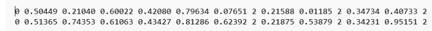
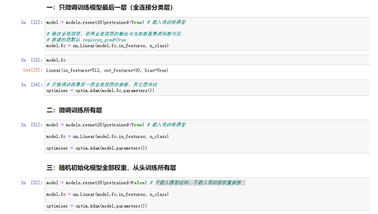

# **期末复习大纲**

## **一、单项选择题（每小题 2 分，本题共 40 分）**

### TensorFlow语法基础

| code                                                         | mean                                                         |
| ------------------------------------------------------------ | ------------------------------------------------------------ |
| `tf.constant(张量内容，dtype=数据类型(可选)`                 | 创建一个张量                                                 |
| `tf. convert_to_tensor(数据名，dtype=数据类型(可选))`        | 将`numpy`的数据类型转换为`Tensor`数据类型                    |
| `tf. zeros(维度)`                                            | 创建全为0的张量                                              |
| `tf. ones(维度)`                                             | 创建全为1的张量                                              |
| `tf. fill(维度，指定值)`                                     | 创建全为指定值的张量                                         |
| `tf. random.normal (维度，mean=均值，stddev=标准差)`         | 生成正态分布的随机数，默认均值为0，标准差为1                 |
| `tf. random.truncated_normal (维度，mean=均值，stddev=标准差)` | 生成截断式正态分布的随机数                                   |
| `tf. random. uniform(维度，minval=最小值，maxval=最大值`     | 生成均匀分布随机数                                           |
| `tf.cast (张量名，dtype=数据类型)`                           | 强制tensor转换为该数据类型                                   |
| `tf.reduce_min (张量名)`                                     | 计算张量维度上元素的最小值                                   |
| `tf.reduce_max (张量名)`                                     | 计算张量维度上元素的最大值                                   |
| `tf.reduce_mean (张量名，axis=操作轴)`                       | 计算张量沿着指定维度的平均值                                 |
| `tf.reduce_sum (张量名，axis=操作轴)`                        | 计算张量沿着指定维度的和                                     |
| `tf.Variable(初始值)`                                        | 将变量标记为“可训练”，被标记的变量会在反向传播 中记录梯度信息。神经网络训练中，常用该函数标记待训练参数。 |
| `tf.add（a,b）`                                              | 加  a + b                                                    |
| `tf.subtract（a,b）`                                         | 减 a - b                                                     |
| `tf.multiply（a,b）`                                         | 乘 a * b                                                     |
| `tf.divide（a,b）`                                           | 除 a / b                                                     |
| `tf.square（a）`                                             | 平方 a**2                                                    |
| `tf.pow（a,b）`                                              | 次方  a**b                                                   |
| `tf.sqrt（a）`                                               | 开方 a**-2                                                   |
| `tf.matmul（a,b）`                                           | 矩阵乘 a * b                                                 |
| `data = tf.data.Dataset.from_tensor_slices((输入特征, 标签))` | 切分传入张量的第一维度，生成输入特征/标签对，构建数据集      |
| `tf.GradientTape( )`                                         | 计算损失函数在某一张量处 的梯度                              |
| `enumerate(列表名)`                                          | 遍历每个元素(如列表、元组 或字符串)，组合为：索引 元素，常在for循环中使用。 |
| `tf.one_hot (待转换数据, depth=几分类)`                      | 将待转换数据，转换为one-hot形式的数据输出。                  |
| `tf.nn.softmax`                                              | 构建softmax函数                                              |
| `assign_sub`                                                 | 赋值操作，更新参数的值并返回。                               |
| `tf.argmax (张量名,axis=操作轴)`                             | 返回张量沿指定维度最大值的索引                               |
| `tf.where(条件语句，真返回A，假返回B)`                       | 条件语句真返回A，条件语句假返回B                             |
| `np.random.RandomState.rand(维度)`                           | 返回一个[0,1)之间的随机数                                    |
| `np.vstack (数组 1，数组2)`                                  | 将两个数组按垂直方向叠加                                     |
| `np.mgrid[ 起始值 : 结束值 : 步长 ，起始值 : 结束值 : 步长 , … ]` |                                                              |
| `x.ravel( )`                                                 | 将x变为一维数组，“把 . 前变量拉直”                           |
| `np.c_[ 数组1，数组2， … ]`                                  | 使返回的间隔数值点配对                                       |


###  TensorFlow构建模型过程

- 第一步：import 相关模块，如 `import tensorflow as tf`

- 第二步：指定输入网络的训练集和测试集，如指定训练集的输入 `x_train` 和标签 `y_train`，测试集的输入 `x_test` 和标签 `y_test`。

- 第三步：逐层搭建网络结构，model = tf.keras.models.Sequential()。

  ```python
  ##举例
  
  model= tf.keras.models.Sequential ([ 网络结构 ]) #描述各层网络
  
  ## 网络结构举例
  tf.keras.layers.Flatten() ## 拉直层
  
  tf.keras.layers.Dense(神经元个数, 
                        activation= "激活函数",
  					kernel_regularizer=哪种正则化) ## 全连接层
  
  tf.keras.layers.Conv2D(filters = 卷积核个数, 
                         kernel_size = 卷积核尺寸,
  					 strides = 卷积步长， 
                         padding = " valid" or "same") ## 卷积层
  
  ```

  

- 第四步：在 `model.compile()`中配置训练方法，选择训练时使用的优化器、损失 函数和最终评价指标。

  ```python
  model.compile(optimizer = 优化器,
  			 loss = 损失函数,
  			 metrics = [“准确率”] )
  ```

  

- 第五步：在 `model.fit()`中执行训练过程，告知训练集和测试集的输入值和标签、 每个 batch 的大小（batchsize）和数据集的迭代次数（epoch）。

  ```python
  model.fit(训练集的输入特征, 
            训练集的标签, 
  		 batch_size= , 
            epochs= , 
  		 validation_data=(测试集的输入特征，测试集的标签),
  		 validation_split=从训练集划分多少比例给测试集，
         	  validation_freq = 多少次epoch测试一次)
  
  ```

  

- 第六步：使用 `model.summary()`打印网络结构，统计参数数目。

### 图像分类/目标检测项目的基本流程

1. 数据集收集与清洗
2. 数据分析与可视化
3. 模型训练
4. 模型评估及指标
5. 模型部署

### 图像分类减少过拟合的方法

- 数据清洗
- 增大训练集
- 采用正则化
- 增大正则化参数

### `labelme`文件格式

```
labelme文件格式是一种常用的图像标注数据格式，用于存储图像及其对应的标签信息。该格式通常由两个文件组成：一个是图像文件，另一个是标签文件。

图像文件可以是任意格式的图像文件，例如JPEG、PNG等。标签文件是一个JSON格式的文件，其中包含了图像的标签信息。
--------------------------------------
标签文件的内容包括以下几个部分：

“version”：标签文件的版本号。
“flags”：一些标志位，用于标识标签文件的特殊属性。
“shapes”：一个数组，包含了图像中的所有标签信息。
    “label”：标签的名称。
    “points”：标签的标注起点和终点的坐标。
    “shape_type”：标签的形状类型，例如矩形、多边形等。


--------------------------------------------------------------
{
  "version": "4.5.6",
  "flags": {},
  "shapes": [
    {
      "label": "person",
      "points": [[10, 20], [30, 40]],
      "shape_type": "rectangle"
    },
    {
      "label": "car",
      "points": [[50, 60], [70, 80]],
      "shape_type": "rectangle"
    }
  ]
}
-------------------------------
这个示例中包含了两个标签，一个是"person"，另一个是"car"。它们分别是矩形形状，起点和终点的坐标分别为(10, 20)和(30, 40)，(50, 60)和(70, 80)
```

### `YOLO`框架常用命令及含义

```
eg:
# yolov8n-pose模型，迁移学习微调
!yolo pose train data=Triangle_215.yaml model=yolov8n-pose.pt pretrained=True project=Triangle_215 name=n_pretrain epochs=50 batch=16 device=0

# yolov8n-pose模型，随机初始权重，从头重新学习
!yolo pose train data=Triangle_215.yaml model=yolov8n-pose.pt project=Triangle_215 name=n_scratch epochs=50 batch=16 device=0
-----------------------------------------------
model:传入的model.yaml文件或者model.pt文件，用于构建网络和初始化；
data:训练数据集的配置yaml文件;
pretrained:是否加载预训练的权重；
project：该项目的文件夹名称；
name：用于保存训练文件夹名；
epochs：训练轮次；
batch:训练批次；
device:设备
```

### 模型轻量化的策略（剪枝、知识蒸馏、量化）

```
模型轻量化的原因：减少模型的大小，提高推理速度，让模型能够成功的部署在各个平台上运作
-----------
模型剪枝：
    细粒度剪枝(fine-grained)：即对连接或者神经元进行剪枝，它是粒度最小的剪枝。
    向量剪枝(vector-level)：它相对于细粒度剪枝粒度更大，属于对卷积核内部(intra-kernel)的剪枝。
    核剪枝(kernel-level)：即去除某个卷积核，它将丢弃对输入通道中对应计算通道的响应。
    滤波器剪枝(Filter-level)：对整个卷积核组进行剪枝，会造成推理过程中输出特征通道数的改变。
例如Dropout就是典型的模型剪枝；
---------------------------------
模型量化：
	量化，即将网络的权值，激活值等从高精度转化成低精度的操作过程，例如将32位浮点数转化成8位整型数int8，同时我们期望转换后的模型准确率与转化前相近。
	优势：
		1.更小的模型尺寸；
		2.更低的功耗；
		3.更快的计算速度；
-------------------------------------
知识蒸馏：
	一般地，大模型往往是单个复杂网络或者是若干网络的集合，拥有良好的性能和泛化能力，而小模型因为网络规模较小，表达能力有限。利用大模型学习到的知识去指导小模型训练，使得小模型具有与大模型相当的性能，但是参数数量大幅降低，从而可以实现模型压缩与加速，就是知识蒸馏与迁移学习在模型优化中的应用。
```

## **二、判断题（每小题 1 分，本题共 15 分）**

### 目标检测算法的类型（单阶段和双阶段）

```
单阶段目标检测算法：
	速度快，有更快的推理速度，适用于实时应用或对速度要求较高的场景。（快 实时性好）；
	虽然单阶段算法在速度方面具有优势，但它们通常在准确性上略逊于双阶段算法。然而，一些高级单阶段算法已经在准确性方面取得了显著进展。（准确性略差）
	代表算法：YOLO,SSD等
---------------------------------
双阶段目标检测算法：
	双阶段算法通常在目标检测任务的准确性方面表现出色。它们可以提供高质量的目标检测结果，特别适用于复杂场景和需要高精度的应用。（适用于复杂场景和高精度应用）；
	由于需要两个独立的阶段，双阶段算法通常需要更多的计算资源和时间。因此，它们的推理速度相对较慢。（慢）；
	代表算法：Faster R-CNN、Mask R-CNN、Cascade R-CNN等

```

### `labelme`文件格式的理解（选择部分详解---》）

### 网络宽度与网络深度的训练难度

```
	网络宽度通常在训练集上产生较好的性能，但需要更多的数据来防止过拟合。 如果你的数据有限，可以考虑减小网络宽度，以减少过拟合的风险。 通常，增加宽度是一种增加模型复杂度的方式，适用于任务较复杂的问题，如大规模图像分类或自然语言处理。 
	网络深度： 网络深度指的是神经网络中的层数。 增加深度可以增加模型的抽象能力，使其能够学习更高级的特征。 然而，深度也会增加训练时间和梯度消失/爆炸的问题。 
-------------------------------------------------------
对于某些任务，深度网络可能不是最佳选择，因为训练深层网络可能会很困难，需要大量的数据和计算资源。
```

### YO LO框架相关（模型选择）

```
目标检测、目标追踪、实例分割、关键点检测
detect、segment、classification，pose
```

## **三、填空题（本大题共 15 空，共 15 分）**

### 爬虫图片数据处理

- 删除非三通道图片
- 删除`GIF`图片；
- 删除多余的`.ipynb_checkpoints`目录

### 图片预处理步骤

- 缩放、裁剪、转Tensor和归一化

### 正向传播一般会得到两个数据结果

- 置信度和所对应的索引

### 评价图像分类任务的四个指标

- `accuracy`（准确率）：表示分类正确的样本占总样本个数的比例。
- `precision`（精确率）：表示预测结果为正例的样本中实际为正样本的比例。
- `recall`（召回率）：表示预测结果为正样本中实际正样本数量占全样本中正样本的比例。
- `F1-score`：精确率和召回率的一个加权平均

## **四、简答题（本大题共 30 分，每小题 6 分，共 5 小题）**

三角板关键点检测yolo数据格式及其含义



```
class x_center y_center w h x_point y_point 0
                                            1
                                            2
```

```
格式为txt
含义：
第一个数据为0，表示该目标的类别，（钝角，直角，锐角其中的一个）
第二个数据为目标中心位置x
第三个数据为目标中心位置y
第四个数据为目标宽度w
第五个数据为目标高度h
第六、七个数据为后边的坐标表示了关键点的坐标，
第八个数据为以及是否可见，其中 0.00000 表示没有显露出不可见，1.00000 表示被遮挡不可见，2.00000 表示可见
```

### 图像分类任务：只训练最后一层：全参数微调、全框架微调，三种训练方式的区别



```
区别：
数据量少，但数据相似度非常高，在这种情况下之训练最后一层；
如果相似度低，就使用全框架微调；
如果数据量大，采用全框架微调，只载入模型结构，不载入预训练权重参数
```

### 关键点检测任务数据集划分的实现流程

- 确定测试集比例，设置随机种子

- 随机打乱数据集

- 获得训练集文件列表，测试集列表

- 将训练集图像移动到`images/trian`目录

- 将测试集图像移动到`images/val`目录

-  将训练集标注移动到`labelme_jsons/train`目录

-  将测试集标注移动到`labelme_jsons/val`目录

-  删除系统自动生成的多余文件

- `labelme`格式 转 `yolo`格式

  1. 编写函数

     - 获取图片的宽高

     - 获得框的类别信息

     - 获取左上角和右下角的 XY 像素坐标

       ```python
       '''
       each_ann['points'][0]:代表第一个点的坐标，
       each_ann['points'][0][0]:代表第一个点的坐标中x的坐标
       each_ann['points'][0][1]:代表第一个点的坐标中x的坐标
       
       min():比较出最小值
       max():比较出最大值
       
       ''' 
       ## 比较第一个点和第二个点的x坐标，返回较小的值，用于确定包围框的左上角x坐标。
       bbox_top_left_x = int(min(each_ann['points'][0][0], each_ann['points'][1][0])) 
       
       ## 比较第一个点和第二个点的x坐标，返回较大的值，用于确定包围框的右下角x坐标。
       bbox_bottom_right_x = int(max(each_ann['points'][0][0], each_ann['points'][1][0]))
       
       ## 比较第一个点和第二个点的x坐标，返回较小的值，用于确定包围框的左下角y坐标。
       bbox_top_left_y = int(min(each_ann['points'][0][1], each_ann['points'][1][1]))
       
       ## ## 比较第一个点和第二个点的x坐标，返回较大的值，用于确定包围框的右下角y坐标。
       bbox_bottom_right_y = int(max(each_ann['points'][0][1], each_ann['points'][1][1]))
       ```

     - 计算框中心点的 XY 像素坐标

       ```python
       bbox_center_x = int((bbox_top_left_x + bbox_bottom_right_x) / 2)
       bbox_center_y = int((bbox_top_left_y + bbox_bottom_right_y) / 2)
       ```

     - 计算框高度和宽度，并且归一化

       ```python
       # 框宽度
       bbox_width = bbox_bottom_right_x - bbox_top_left_x
       # 框高度
       bbox_height = bbox_bottom_right_y - bbox_top_left_y
       # 框中心点归一化坐标
       bbox_center_x_norm = bbox_center_x / img_width
       bbox_center_y_norm = bbox_center_y / img_height
       # 框归一化宽度
       bbox_width_norm = bbox_width / img_width
       # 框归一化高度
       bbox_height_norm = bbox_height / img_height
       ```
       
     - 找出所有关键点
     
     - 将关键点按顺序排好
  
- 转换训练集标注文件至`labels/train`目录

- 转换训练集标注文件至`labels/val`目录

- 删除`labelme`格式的标注文件

### yolo命令

```bash
yolo task=detect mode=train mode=model.yaml data=训练数据集的配置yaml文件 epochs=训练轮次 batch= device=0	   		
		 segment	 val        model.pt		                                                    0,1	
		 classify    predict                                                                         cpu
		 pose 	     export
```

| key            | 解释                                                         |
| -------------- | ------------------------------------------------------------ |
| `model`        | 传入的model.yaml文件或者model.pt文件，用于构建网络和初始化，不同点在于只传入yaml文件的话参数会随机初始化 |
| `data`         | 训练数据集的配置yaml文件                                     |
| `epochs`       | 训练轮次，默认100                                            |
| `patience`     | 早停训练观察的轮次，默认50，如果50轮没有精度提升，模型会直接停止训练 |
| `batch`        | 训练批次，默认16                                             |
| `imgsz`        | 训练图片大小，默认640                                        |
| `save`         | 保存训练过程和训练权重，默认开启                             |
| `save_period`  | 训练过程中每x个轮次保存一次训练模型，默认-1（不开启）        |
| `device`       | 要运行的设备，即cuda device =0或Device =0,1,2,3或device = cpu |
| `workers`      | 载入数据的线程数。windows一般为4，服务器可以大点，windows上这个参数可能会导致线程报错，发现有关线程报错，可以尝试减少这个参数，这个参数默认为8，大部分都是需要减少的 |
| `project`      | 项目文件夹的名，默认为runs                                   |
| `name`         | 用于保存训练文件夹名，默认exp，依次累加                      |
| `pretrained`   | 是否加载预训练权重，默认Flase                                |
| `close_mosaic` | 最后x个轮次禁用马赛克增强，默认10                            |

### 目标检测、图像分割和关键点检测三大计算机视觉研究任务的研究内容

1. 目标检测：目标检测的任务是在图像或视频中识别和定位特定的物体或目标。它通常包括两个步骤：目标检测和目标分类。目标检测是确定图像中是否存在目标，并定位其位置和大小；目标分类则是对检测到的目标进行分类。研究内容包括特征提取、模型选择、数据标注与训练、性能评估等。
2. 图像分割：图像分割是将图像划分为多个有意义的区域或对象的技术。它旨在识别和提取图像中的各个部分，以便进一步分析和处理。研究内容包括边缘检测、区域分割、超像素分割、深度学习等。此外，图像分割还涉及颜色、纹理、形状等视觉特征的提取和分析，以实现更精确的分割效果。
3. 关键点检测：关键点检测是计算机视觉中的一个基础任务，用于识别图像或视频中具有重要意义的特征点。这些点可以用于进一步的目标跟踪、姿态分析、动作识别等应用。关键点检测技术通常涉及特征提取和模型训练，以自动确定图像中的关键点位置。研究内容包括特征选择、模型训练、尺度不变性、旋转不变性等。

