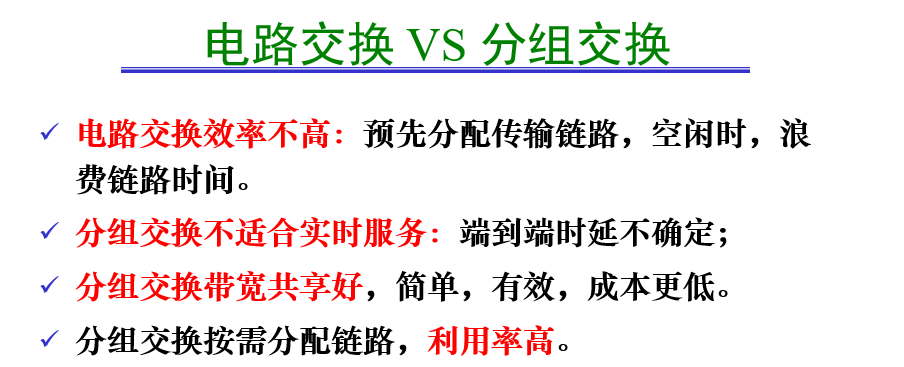
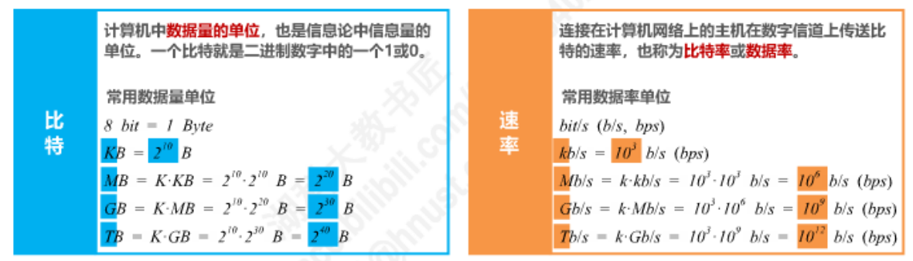
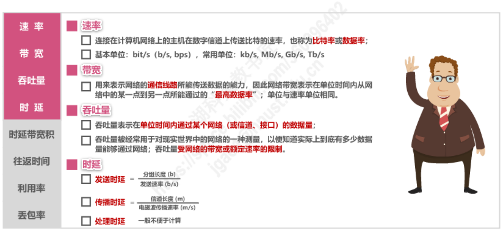
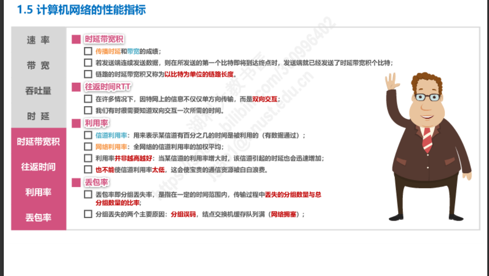
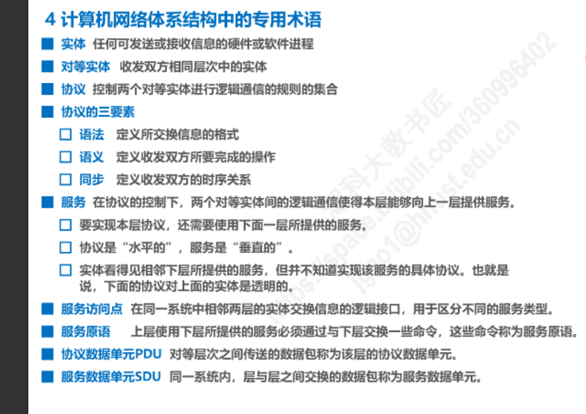

# 计算机网络复习

## 第二章

### 三种交换方式（电路交换和分组交换的区别，Internet使用的是什么交换方式）

1. 三种交换方式：

   - 电路交换
   - 分组交换
   - 报文交换

2. 电路交换和分组交换的区别

   

3. Internet使用的是什么交换方式

   - 分组交换

### 影响网络性能的因素

1. 速率

   

1. 带宽
2. 吞吐量
3. 时延
4. 时延带宽积
5. 往返时间
6. 利用率
7. 丢包率

### 四种网络拓扑图（总线，环型，网状，星型）哪些会造成单点故障（总线（总线故障），环型，星型（交换机故障））

### 因特网的服务提供商

ISP

### 协议和服务区别

### 时延的计算

发送时延 = $\dfrac{分组长度(b)}{发送速率(b/s)}$

传播时延 = $\dfrac{信道长度(m)}{电磁波传播速率(m/s)}$

### TCP/IP五层模型(应用层、传输层、网络层、数据链路层、物理层)

### 信号（数字信号和模拟信号）

## 第二章

### 唯一的区别进程用什么

端口号

### 套接字的组成（端口号和IP地址，端口号（port）多少位）

端口号16位

### 应用层体系结构（C/S,p2p,混合）

### HTTP协议（请求和响应报文，持续和非持续连接，给一段HTTP的报文会不会看包含的具体信息）

### 邮件服务协议（SMTP，POP3，MIME，IMAP）

### Web缓存

### FTP协议

### DNS（查询方式，端口）

### DHCP协议

## 第三章

### UDP首部格式

### TCP首部格式

### 运输层提供什么之间的逻辑通信方式

### TCP提供的服务（可靠，流量控制，差错控制，拥塞控制）

### 端口（两大类，三种类型的端口）

### TCP三次握手

### TCP和UDP的区别

## 第四章

### IP首部格式

### 解决IPV4地址短缺问题（分类编码，无分类编码（Classless），网络地址转换，子网掩码）

### ICMP协议

### 子网划分

### 判断是否在同一子网中

### 路由器组成条目

### Tracert

### 网络层和运输层的主要区别

### 什么是 NAT？NAT 的优缺点各是什么？

## 第五章

### 分装成帧

### MAC地址（唯一的区分不同的设备）

### PPP和CSMA/CD 协议

### ARP协议

### 物理传输媒体有哪些

### 接入网

### 802.11g使用的通信频段为？

## 英文全称