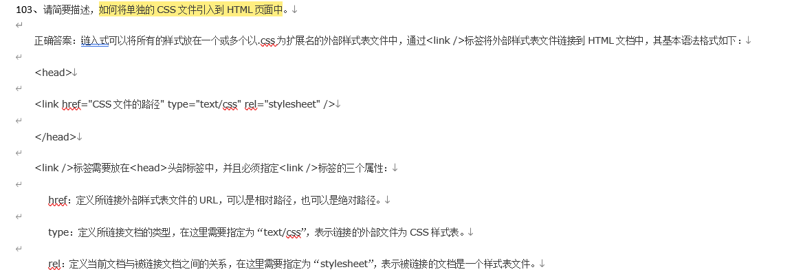

# 前端期末复习

## 单选题

单选题（共374分）

1、下列选项中，用于设置页面标题的标签是（）
A、`<title>`
B、`<caption>`
C、`<head>`
D、`<html>`
正确答案：A

2、关于CSS样式规则的具体格式，下列选项正确的是（）
A、选择器{属性1:属性值1; 属性2:属性值2 属性3:属性值3}
B、选择器{属性1:属性值1, 属性2:属性值2, 属性3:属性值3;}
C、选择器{属性1:属性值1; 属性2:属性值2; 属性3:属性值3;}
D、选择器{属性1:属性值1 属性2:属性值2 属性3:属性值3}
正确答案：C

3、在HTML中，用于设置页面元信息的标签是（）
A、`<title>`
B、`<base>`
C、`<head>`
D、`<meta />`
正确答案：D

4、在VS Code中，新建文件的快捷键是（）
A、Ctrl+N
B、F2
C、Ctrl+S
D、Enter
正确答案：A

5、下列选项中，用于规定过渡效果速度曲线的属性是（）
A、transition-property属性
B、transition-duration属性
C、transition-timing-function属性
D、transition-delay属性
正确答案：C

6、下列样式代码中，可以将行内元素转换为块元素的是（）
A、display:none;
B、display:block;
C、display:inline-block;
D、display:inline;
正确答案：B

7、下列属性中，用于合并水平方向的单元格是（）
A、width
B、bgcolor
C、rowspan
D、colspan
正确答案：D

8、在嵌入视频的基本语法格式中，用于控制是否显示播放控件的属性是（）
A、controls
B、src
C、loop
D、autoplay
正确答案：A

9、在VS Code中，保存文件的快捷键是（）
A、Ctrl+N
B、F2
C、Ctrl+S
D、Enter
正确答案：C

10、下面的代码中，可以设置单元格宽度的是（）
A、td{width:50px;}
B、td{height:50px;}
C、td{line-height:50px;}
D、td{font-size:50px;}
正确答案：A

11、在CSS中，用于设置首行文本缩进的属性是（）
A、text-decoration
B、text-align
C、text-transform
D、text-indent
正确答案：D

12、在嵌入视频的基本语法格式中，用于设置视频文件路径的属性是（）
A、controls
B、src
C、loop
D、autoplay
正确答案：B

13、下列选项中，用于设置网页关键字的属性值为（）
A、keywords
B、description
C、author
D、Content-Type
正确答案：A

14、下面选项中，可以将HTML5页面的标题设置为“我爱学习”的是（）
A、`<head>我爱学习</head>`
B、`<title>我爱学习</title>`
C、`<h>我爱学习</h>`
D、`<t>我爱学习</t>`
正确答案：B

15、下列选项中，用于设置字间距的属性是（）
A、letter-spacing
B、word-spacing
C、line-height
D、text-transform
正确答案：A

16、在下列新的input属性中，用于指定页面加载后是否自动获取焦点的属性是（）
A、autofocus
B、form
C、list
D、multiple
正确答案：A

17、网页中的图像文件位于html文件的下一级文件夹img下，则以下CSS书写正确的是（）
A、``
B、``
C、``
D、``
正确答案：C

18、在`<source>`标签的属性中，用于指定URL地址的是（）
A、margin
B、type
C、src
D、padding
正确答案：C

19、在定义列表中，用于对名词进行解释的标签是（）
A、`<dl>`
B、`<li>`
C、`<dt>`
D、`<dd>`
正确答案：D

20、在表格中，用于设置表格边框的属性是（）
A、border
B、cellspacing
C、cellpadding
D、background
正确答案：A

21、在VS Code中，快速创建注释的快捷键是（）
A、Ctrl+N
B、Ctrl+/
C、Ctrl+S
D、Enter
正确答案：B

22、在``标签中，用于指定图像文件路径的属性是（）
A、src
B、alt
C、width
D、height
正确答案：A

23、下列标签中，可以添加水平线的是（）
A、`<h1>`
B、`<hr />`
C、``
D、`<p>`
正确答案：B

24、下列选项中，用于定义执行动画效果之前延迟时间的属性是（）
A、 animation-duration属性
B、 animation-timing-function属性
C、 animation-delay属性
D、 animation-direction属性
正确答案：C

25、下列选项中，可以指定元素围绕X轴旋转的是（）
A、rotateX()函数
B、rotateY()函数
C、C rotateZ()函数
D、rotate3d ()方法
正确答案：A

26、当页面载入完成后，可以自动播放视频的属性是（）
A、autoplay
B、loop
C、preload
D、poster
正确答案：A

28、下列选项中，可以实现空格效果的标签是（）
A、`&lt;`
B、`&nbsp;`
C、`&gt;`
D、`&`
正确答案：B

29、下列选项中，用于设置网页作者的属性值为（）
A、keywords
B、description
C、author
D、Content-Type
正确答案：C

30、下列选项中，用于规定动画速度曲线的属性是（）
A、 animation-duration属性
B、 animation-timing-function属性
C、 animation-delay属性
D、 animation-direction属性
正确答案：B

31、在表格中，用于设置表格背景颜色的属性是（）
A、border
B、cellspacing
C、cellpadding
D、bgcolor
正确答案：D

32、下列选项中，transition-duration属性语法格式书写正确的是（）
A、transition-duration:time;
B、transition-duration:linear;
C、transition-duration:property
D、transition-duration:all
正确答案：A

33、使用list-style复合属性定义列表项目符号为`“■”`且位于列表文本以内的列表，下列代码书写正确的是（）
A、list-style:circle inside;
B、list-style:square inside;
C、list-style:circle outside;
D、list-style:square outside;
正确答案：B

35、下列选项中，不属于``标签的属性是（）
A、`src`
B、`alt`
C、`width`
D、`href`
正确答案：D

36、下列格式中，可以保存动画的是（）
A、jpeg格式
B、gif格式
C、psd格式
D、png格式
正确答案：B

37、transition-timing-function属性值中，可以指定过渡效果以慢速开始和慢速结束的是（）
A、ease
B、ease-out
C、ease-in
D、ease-in-out
正确答案：D

38、下列选项中，属于`<option>`标签属性的是（）
A、size
B、multiple
C、selected
D、value
正确答案：C

39、下列选项中，用于定义表格页脚的标签是（）
A、`<thead>`
B、`<tfoot>`
C、`<tbody>`
D、`<th>`
正确答案：B

41、下列选项中，哪一项是段落标签（）
A、`<h1>`
B、`<br />`
C、``
D、`<p>`
正确答案：D

42、下列选项中，能够使:target选择器设置的样式有效的行为是（）
A、用户打开页面
B、用户在页面空白处右击
C、用户单击页面中的超链接并跳转到target元素
D、用户单击页面中的超链接并跳转到任意元素
正确答案：C

43、下列选项中，用于定义网页内容是否可以编辑的属性是（）
A、draggable
B、datetime
C、pubdate
D、contenteditable
正确答案：D

44、下列选项中，设置鼠标指针单击不动时超链接样式的状态化伪类选择器是（）
A、`a:link{ CSS样式; }`
B、`a:visited{ CSS样式; }`
C、`a:hover{ CSS样式; }`
D、`a: active{ CSS样式; }`
正确答案：D

45、下列选项中，用于设置边框宽度的属性是（）
A、`border-color`
B、`border-width`
C、`background-color`
D、`border-style`
正确答案：B

46、下列标签中，用于定义HTML5文档显示内容的是（）
A、 `<head>`
B、`<body>`
C、 `<html>`
D、` <title>`
正确答案：B

48、在`<source>`标签的属性中，用于指定媒体文件格式的是（）
A、`margin`
B、`type`
C、`src`
D、`padding`
正确答案：B

49、下列选项中，设置鼠标指针悬停时超链接样式的状态化伪类选择器是（）
A、`a:link{ CSS样式; }`
B、`a:visited{ CSS样式; }`
C、`a:hover{ CSS样式; }`
D、`a: active{ CSS样式; }`
正确答案：C

50、下列选项中，能够使任何元素呈现出透明效果的是（）
A、opacity
B、RGBA
C、background
D、scroll
正确答案：A

51、下列选项中，普通兄弟选择器的连接符是（）
A、`-`
B、`+`
C、`>`
D、`~`
正确答案：D

52、下列属性中，用来定义文本字体的是（）
A、color
B、align
C、size
D、face
正确答案：D

53、在下列属性值中，用于定义过渡效果属性名称的是（）
A、none
B、true
C、all
D、property
正确答案：D

54、在VS Code中，重命名的快捷键是（）
A、Ctrl+N
B、F2
C、Ctrl+S
D、Enter
正确答案：B

55、下列选项中，并集选择器书写方式正确的是（）
A、`h1 p{}`
B、`h1_p{}`
C、`h1,p{}`
D、`h1-p{}`
正确答案：C

57、下列选项中，可以在元素之后插入内容的选择器是（）
A、`:not`
B、`:empty`
C、`:after`
D、`:root`
正确答案：C

58、下列选项中，能够清除浮动的属性是（）
A、float
B、clear
C、static
D、relative
正确答案：B

59、下列样式代码中，可以将块元素转换为行内元素的是（）
A、display:none;
B、display:block;
C、display:inline-block;
D、display:inline;
正确答案：D

61、下列选项中，用于定义表格头部的标签是（）
A、`<thead>`
B、`<tfoot>`
C、`<tbody>`
D、`<th>`
正确答案：A

62、在下列选择器中，用于选择父级标签的子标签的是（）
A、子代选择器
B、兄弟选择器
C、属性选择器
D、伪类选择器
正确答案：A

63、下列选项中，用于处理溢出文本的属性是（）
A、text-overflow
B、text-align
C、text-shadow
D、text-indent
正确答案：A

64、下列选项中，属于transition-timing-function属性的默认值为（）
A、ease
B、linear
C、ease-in
D、ease-out
正确答案：A

69、下列标签中，可以将标题字号设置最大的是（）
A、`<h1>`
B、`<h2>`
C、`<h3>`
D、`<h4>`
正确答案：A

70、下列选项中，不属于HTML5转义字符的是（）
A、`&nbsp;`
B、`&lt;`
C、`&gt;`
D、`&top;`
正确答案：D

72、下列选项中，用于定义过渡效果持续时间的属性是（）
A、transition-property属性
B、transition-duration属性
C、transition-timing-function属性
D、transition-delay属性
正确答案：B

75、下列选项中，属于HTML5标签设置属性的语法格式是（）
A、`<标签名 属性1="属性值1" 属性2="属性值2" …>内容</标签名>`
B、`<标签名>内容</标签名>`
C、`< 标签名 />`
D、`< /标签名>`
正确答案：A

78、下列选项中，可以使图像只沿着水平方向平铺的是（）
A、repeat
B、no-repeat
C、repeat-x
D、repeat-y
正确答案：C

79、下列选项中，transition-duration属性的默认值为（）
A、none
B、0
C、all
D、property
正确答案：B

81、下列选项中，可以设置列表项目符号位于列表文本以内的是（）
A、list-style-position:inside;
B、list-style-position:outside;
C、list-style-position:none;
D、list-style-position:0;
正确答案：A

85、在下列新的input属性中，用于制作提示输入效果的属性是（）
A、autofocus
B、form
C、list
D、multiple
正确答案：C

86、下列选项中，属于animation-timing-function默认属性值的是（）
A、linear
B、ease
C、ease-out
D、ease-in-out
正确答案：B

87、下列选项中，用于规定过渡效果何时开始的属性是（）
A、transition-property
B、transition-duration
C、transition-timing-function
D、transition-delay
正确答案：D

88、下列选项中，可以为页面中的文本添加阴影效果的属性是（）
A、text-decoration
B、text-align
C、text-shadow
D、text-indent
正确答案：C

89、在嵌入音频的基本语法格式中，用于为音频提供播放控件的属性是（）
A、controls
B、src
C、loop
D、autoplay
正确答案：A

90、下列选项中，用于显示或隐藏元素的属性是（）
A、draggable
B、datetime
C、pubdate
D、hidden
正确答案：D

92、下列属性中，用于设置图像提示文字的是（）
A、title
B、alt
C、width
D、height
正确答案：A

95、下列选项中，可以指定元素围绕Y轴旋转的是（）
A、rotateX()函数
B、rotateY()函数
C、C rotateZ()函数
D、rotate3d ()方法
正确答案：B

96、下列选项中，代表内边距属性的是（）
A、padding
B、margin
C、border
D、background
正确答案：A

97、下列选项中，用于实现URL地址自动换行的属性是（）
A、text-overflow
B、word-wrap
C、text-shadow
D、text-indent
正确答案：B

98、下列选项中，哪一项是网页布局的基础（）
A、单列布局
B、两列布局
C、三列布局
D、通栏布局
正确答案：A

103、关于有序列表和无序列表的嵌套，下列代码书写正确的是（）
A、

```html
 <ol>
 <ul>
 <li>列表项1</li>
 li>列表项2</li>
 </ul>
 </ol>
```


B、
```html
 <ol>
 <ul>
 <li>列表项1</li>
 <li>列表项2</li>
 </ol>
 </ul>
```
C、
```html
 <ol>
 <li>列表项1
 <ul>
 <li>列表项1</li>
 <li>列表项1</li>
 </ul>
 </li>
 <li>列表项2</li>
 </ol>
```
D、
```html
 <ol>
 <ul>
 <ol></ol>
 </ul>
 </ol>
```
正确答案：C

104、下列选项中，用于设置页面自动刷新与跳转的属性值为（）
A、keywords
B、description
C、author
D、refresh
正确答案：D

106、下列选项中，对HTML5新功能和新特性支持最好的浏览器是（）
A、IE浏览器
B、火狐浏览器
C、谷歌浏览器
D、Opera浏览器
正确答案：C

108、下列选项中，用于匹配文档根标签的选择器是（）
A、:not
B、:only-child
C、:first-child
D、:root
正确答案：D

109、下列选项中，设置超链接默认样式的状态化伪类选择器是（）
A、a:link{ CSS样式; }
B、a:visited{ CSS样式; }
C、a:hover{ CSS样式; }
D、a: active{ CSS样式; }
正确答案：A

112、下列`<tr>`属性中，用来设置行背景颜色的是（）
A、height
B、align
C、bgcolor
D、background
正确答案：C

115、下列选项中，关于:not选择器的描述正确的是（）
A、用于匹配文档根标签
B、使用:root选择器定义的样式，对所有页面标签都生效
C、可以排除设置的标签或属性
D、用于选取父标签中的唯一子标签
正确答案：C

118、下列选项中，代表外边距属性的是（）
A、padding
B、margin
C、border
D、background
正确答案：B

120、下列选项中，临近兄弟选择器的连接符是（）
A、-
B、+
C、>
D、~
正确答案：B

122、关于创建锚点链接的代码，下列书写正确的是（）
A、
```html
 <a href="#one">链接文本</a>
 ………

 <h3 id="one">锚点链接 </h3>
```
B、
```html
 <a href="#id">链接文本</a>
 ………

 <h3 id="one">锚点链接 </h3>
```
C、
```html
 <a href="#">链接文本</a>
 ………

 <h3 id="one">锚点链接 </h3>
```
D、
```html
 <a href="#one">链接文本</a>
 ………

 <h3 id="#one">锚点链接 </h3>
```
正确答案：A

131、在下列overflow的属性值中，可以使内容不被修剪且会呈现在标签框之外的属性值是（）
A、visible
B、hidden
C、auto
D、scroll
正确答案：A

133、下列选项中，能够让元素倾斜显示的是（）
A、 translate()
B、 scale()
C、 skew()
D、 rotate()
正确答案：C

136、下列标签中，可以将文本内容强制换行显示的是（）
A、`<h1>`
B、`<br />`
C、``
D、`<p>`
正确答案：B

142、关于使用list-style复合属性综合设置列表样式的语法格式，下列书写正确的是（）
A、list-style:列表项目符号 列表项目符号的位置 列表项目图像;
B、list-style:列表项目符号.列表项目符号的位置.列表项目图像;
C、list-style:列表项目符号，列表项目符号的位置，列表项目图像;
D、list-style:列表项目符号/列表项目符号的位置/列表项目图像;
正确答案：A

146、下列选项中，用于描述文档标题、作者的标签是（）
A、`<head>`
B、`<body>`
C、`<html>`
D、`<title>`
正确答案：A

148、关于内嵌式引入CSS样式表的代码，下列书写正确的是（）
A、`<style type="text/stylesheet”></style>`
B、`<style type="text/css”></style>`
C、`<css type="text/style”></css>`
D、`<css type="text/stylesheet”></css>`
正确答案：B

151、下列选项中，能够使背景图像相对于边框进行定位的属性值是（）
A、padding-box
B、border-box
C、content-box
D、contain
正确答案：B

157、下列选项中，能够定义浮动的属性是（）
A、float
B、clear
C、static
D、relative
正确答案：A

158、下列选项中，用于设置网页描述的属性值为（）
A、keywords
B、description
C、author
D、Content-Type
正确答案：B

164、在CSS中，可以将标签的定位模式设置为绝对定位的是（）
A、position:static;
B、position:relative;
C、position:absolute;
D、position: fixed;
正确答案：C

165、overflow属性值中，可以修剪溢出内容的属性值是（）
A、visible
B、hidden
C、auto
D、scroll
正确答案：B

166、下列选项中，能够更改元素左内边距的代码是（）
A、text-indent
B、padding-left
C、margin-left
D、padding-right
正确答案：B

167、下列选项中，音质最好的音频格式是（）
A、ogg
B、mp3
C、webm
D、wav
正确答案：D

180、下列选项中，可以为video标签设置高度的属性是（）
A、height
B、width
C、size
D、top
正确答案：A

181、下列选项中，代表边框属性的是（）
A、padding
B、margin
C、border
D、background
正确答案：C

188、下列选项中，可以实现圆角效果的属性是（）
A、border-radius
B、border-image
C、box-shadow
D、background-size
正确答案：A

196、下列选项中，用来定义元素是否可以拖动的属性是（）
A、draggable
B、datetime
C、pubdate
D、low
正确答案：A

199、下列选项中，用于定义动画名称的属性是（）
A、 animation-duration属性
B、 animation-timing-function属性
C、 animation-name属性
D、 animation-direction属性
正确答案：C

200、在HTML5文档基本格式中，用于向浏览器说明当前文档使用哪种 HTML版本的标签是（）
A、`<!DOCTYPE>`
B、`<head>`
C.`<title>`
D、`<html>`
正确答案：A

204、下列选项中，用于设置边框样式的属性是（）
A、border-color
B、border-width
C、background-color
D、border-style
正确答案：D

206、下列input控件类型中，可用于输入搜索关键词的是（）
A、`email类型<input type="email" />`
B、`url类型<input type="url" />`
C、`search 类型<input type="search" />`
D、`color类型<input type="color" />`
正确答案：C

218、下列选项中，可以设置背景图像位置的属性是（）
A、background-repeat
B、background-position
C、background-attachment
D、background-size
正确答案：B

230、在嵌入音频的基本语法格式中，用于设置音频文件路径的属性是（）
A、controls
B、src
C、loop
D、autoplay
正确答案：B

241、下列选项中，用于设置边框颜色的属性是（）
A、border-color
B、border-width
C、background-color
D、border-style
正确答案：A

248、border-style属性值中，可以设置边框为虚线的是（）
A、none
B、solid
C、dashed
D、double
正确答案：C

286、下列选项中，id选择器的基本语法格式书写正确的是（）
A、#id名{属性值1;属性值2;属性值3; }
B、 #id名{属性1:属性值1; 属性2:属性值2; 属性3:属性值3;}
C、 #id名{属性1:属性值1，属性2:属性值2，属性3:属性值3}
D、 #id名{属性1:“属性值1”; 属性2:“属性值2”; 属性3:“属性值3”; }
正确答案：B

287、border-style属性值中，可以设置边框为单实线的是（）
A、none
B、solid
C、dashed
D、double
正确答案：B

289、下列选项中，能够从内容区域向外裁剪背景的属性值是（）
A、padding-box
B、border-box
C、content-box
D、contain
正确答案：C

290、关于代码“table{border:1px solid red;}”的含义，下列说法正确的是（）
A、设置table的边框为一像素的红色实线
B、设置单元格的边框为一像素的红色实线
C、设置table的边框为一像素的红色虚线
D、设置单元格的边框为一像素的红色虚线
正确答案：A

292、关于background-size属性的语法格式，下列选项正确的是（）
A、background-size:属性值1 属性值2;
B、background-size:属性值1;属性值2;
C、background-size:属性值1;属性值2
D、background-size:属性值1; 属性值2.
正确答案：A

293、下列选项中，用于定义动画播放次数的属性是（）
A、 animation-iteration-count属性
B、 animation-timing-function属性
C、 animation-delay属性
D、 animation-direction属性
正确答案：A

294、下列选项中，能够定义一个淡入动画的属性是（）
A、 animation-duration属性
B、 animation-timing-function属性
C、 @keyframes属性
D、 animation-direction属性
正确答案：C

295、下列选项中，由微软公司推出的浏览器是（）
A、IE浏览器
B、 B.火狐浏览器
C、 C.谷歌浏览器
D、 D.以上都不是
正确答案：A

296、关于行内式引入CSS样式表的代码，下列书写正确的是（）
A、`<p style=font-size:12px; color:red;>段落文本</p>`
B、`<p style="font-size:12px, color:red;">段落文本</p>`
C、`<p style="font-size:12px; color:red;">段落文本</p>`
D、`<p style="font:12px; color:red;">段落文本</p>`
正确答案：C

297、下列选项中，用于定义当前动画播放方向的属性是（）
A、 animation-iteration-count属性
B、 animation-timing-function属性
C、 animation-delay属性
D、 animation-direction属性
正确答案：D

298、下列选项中，用于定义整个动画效果完成所需时间的属性是（）
A、 animation-duration属性
B、 animation-timing-function属性
C、 animation-name属性
D、 animation-direction属性
正确答案：A

299、下列标签属性中，可以为各个列表项设置图像符号的属性是（）
A、list-style-image
B、list-style
C、list-style-position
D、list-style-type
正确答案：A

300、下列行为中，能够弹出对话框的是（）
A、DOM
B、 B.BOM
C、 C.HTML
D、 D.ECMAScript
正确答案：B

303、当<p>标签内嵌套`<strong>`标签时，就可以使用后代选择器对其中的`<strong>`标签进行控制，下列写法正确是（）
A、strong p{color:red;}
B、p strong{color:red;}
C、strong,p{color:red;}
D、p.strong{color:red;}
正确答案：B

304、在HTML到HTML5的演变过程中，下列选项被称为“可扩展超文本标签语言”的是（）
A、HTML2.0
B、 B.HTML4.01
C、 C.XHTML1.0
D、 D.HTML5
正确答案：C

306、关于样式代码“.box{width:200px; padding:15px; margin:20px;}”的描述，下列说法正确的是（）
A、.box的总宽度为200px
B、.box的总宽度为 270px
C、.box的总宽度为 235px
D、以上说法均错误
正确答案：B

307、下列选项中，类选择器的基本语法格式书写正确的是（）
A、 .类名{属性值1;属性值2;属性值3; }
B、.类名{属性1:属性值1，属性2:属性值2，属性3:属性值3}
C、.类名{属性1:属性值1; 属性2:属性值2; 属性3:属性值3;}
D、.类名{属性1:“属性值1”; 属性2:“属性值2”; 属性3:“属性值3”; }
正确答案：C

309、下列选项中，用于设置超链接被访问过之后样式的状态化伪类选择器是（）
A、a:link{ CSS样式; }
B、a:visited{ CSS样式; }
C、a:hover{ CSS样式; }
D、a: active{ CSS样式; }
正确答案：B

310、在书写样式时，下列代码书写正确的是（）
A、h1{font：12px;}
B、h1[font_size:12px;]
C、h1(font：size=12px;)
D、D .h1{font-size:12px;}
正确答案：D

312、下列代码中，能够指定元素围绕X轴逆时针旋转45度的是（）
A、 transform:rotateX(45deg)
B、 transform:rotateX(-45deg)
C、 transform:rotateX(135deg)
D、 transform:rotateX(225deg)
正确答案：B

318、在CSS中，可以将标签的定位模式设置为相对定位的是（）
A、 position:static;
B、 position:relative;
C、 position:absolute;
D、 position: fixed;
正确答案：B

319、下列样式代码中，可实现元素的溢出内容被修剪，且被修剪的内容不可见的是（）
A、 overflow:visible;
B、 overflow: hidden;
C、 overflow: auto;
D、 overflow: scroll;
正确答案：B

322、下列选项中，可以作为`<details>`标签第一个子标签的是（）
A、`<nav>标签`
B、`<summary>标签`
C、`<footer>标签`
D、`<figure>标签`
正确答案：B

323、如果某个父元素仅有一个子元素，那么可以选择子元素的选择器是（）
A、:not
B、:only-child
C、:first-child
D、:root
正确答案：B

326、关于盒子模型中的宽度和高度属性，下面说法正确的是（）
A、盒子模型中的宽度和高度属性适用于所有元素
B、盒子模型中的宽度和高度属性仅适用于行内元素
C、盒子模型中的宽度和高度属性仅适用于块级元素
D、以上说法均正确
正确答案：C

327、代码为`<div id="box" class="red">文字</div>`，为其设置CSS样式如下：

```css
#box{
 color:blue;
 }
 .red{
 color:red;
 }
```

 那么，文字的颜色将显示为（）
A、红色
B、蓝色
C、黑色
D、白色
正确答案：B

328、下列选项中，符合后代选择器书写要求的是（）
A、p strong{ font-weight:bold; }
B、p.strong{ font-weight:bold; }
C、p,strong{ font-weight:bold; }
D、p#div{ font-weight:bold; }
正确答案：A

329、在border-image的属性中，可以指定图片路径的是（）
A、border-image-source
B、border-image-slice
C、border-image-width
D、border-image-repeat
正确答案：A

330、关于特殊字符的描述，下列说法错误的是（）
A、特殊字符的代码通常由前缀“&”.字符名称和后缀为英文状态下的“;”组成
B、可以通过菜单栏直接插入相应特殊字符的代码
C、转义序列各字符间可以有空格
D、转义序列必须以分号结束
正确答案：C

333、下列代码中，能够将列表项目符号设置为大写英文字母的是（）
A、ul{ list-style-type: lower-alpha;}
B、ol{ list-style-type: lower-alpha;}
C、ul{ list-style-type: upper-alpha;}
D、ol{ list-style-type: upper-alpha;}
正确答案：D

338、关于list-style-image属性，下列说法正确的是（）
A、可以为各个列表项设置列表项目图像
B、用于控制列表项显示符号的类型
C、只可以为无序列表的列表项设置项目图像
D、只可以为有序列表的列表项设置项目图像
正确答案：A

339、下列选项中，用于选择没有子标签的选择器是（）
A、:not
B、:empty
C、:first-child
D、:root
正确答案：B

348、关于三列布局的描述，下列说法正确的是（）
A、实现三列布局一般是将内容模块分为左.中.右三个小盒子，然后对三个小盒子分别设置浮动。
B、实现三列布局一般是将内容模块分为左.中.右三个小盒子，然后对三个小盒子分别设置边框。
C、实现三列布局一般是将内容模块分为左.中.右三个小盒子，然后对三个小盒子分别设置定位。
D、实现三列布局一般是将内容模块分为左.中.右三个小盒子，然后对三个小盒子分别设置背景。
正确答案：A

360、下列选项中，用于定义输入框选项列表的是（）
A、`<datalist>`
B、`<textarea>`
C、`<select>`
D、`<form>`
正确答案：A

371、一个盒子的宽（width）和高（height）均为300px，左内边距为30px，同时盒子有3px的边框，那么这个盒子的总宽度是（）
A、333px
B、366px
C、336px
D、363px
正确答案：C

372、下列样式代码中，用于定义盒子上边框为1像素.蓝色.单实线的是（）
A、border-top:1px solid blue;
B、border:1px solid blue;
C、border-top:1px dashed blue;
D、border:1px dashed blue;
正确答案：A

## 多选题

1、关于设置背景图片格式的方法，下列代码正确的有（A,B）
A、body{ background: url(1.png);}
B、body{ background-image: url(1.png);}
C、body{ background-color: url(1.png);}
D、body{ background-repeat: url(1.png);}

2、下列选项中，关于`<div>`标签的描述正确的有（A,C,D）
A、`<div>`标签中可以嵌套多层`<div>`标签
B、`<div>`标签中不能嵌套多层`<div>`标签
C、`<div>`标签可以与id.class等属性结合，替代一些块级标签
D、`<div>`标签是块级标签

3、HTML5中，` <progress>`标签的常用属性值有（A,B）
A、value
B、max
C、min
D、low

4、下列选项中，有序列表的属性包括（B,C,D）
A、background
B、type
C、start
D、value

5、下列选项中，属于`<textarea>`控件的必须属性的有（A,B）
A、cols
B、rows
C、value
D、size

7、下列选项中，属于transition-timing-function属性取值的有（A,B,C,D）
A、ease
B、linear
C、ease-in
D、ease-out

8、关于E[attribute|=value]选择器的描述，下列说法正确的有（C,D）
A、用于选取标签名称为E，并且定义了attribute属性的标签
B、用于选取标签名称为E的标签
C、能够选取带有value属性值的标签。
D、能够选取以value-开头的属性值的标签。

9、在CSS中定义字号大小时，下列代码书写正确的有（A,D）
A、p { font-size:12px;}
B、p { font-size:12 px;}
C、p { font-size: "12px";}
D、p { font-size:12em;}

10、在下列`<td>`标签的属性中，可以合并单元格的是（C,D）
A、col
B、cols
C、rowspan
D、colspan

11、下列选项中，属于表单标签`<form>`的属性是（A,C,D）
A、action
B、size
C、method
D、name

12、下列选项中，border-color属性的取值正确的有（A,B,D）
A、red
B、#F00
C、FF0000
D、rgb(0,255,0)

13、下列样式代码中，可用于设置背景图像平铺方式的有（A,D）
A、background-repeat:no-repeat;
B、 background-attachment:fixed;
C、background-attachment:scroll;
D、background-repeat: repeat-x;

14、下列选项中，关于VS Code界面的描述说法正确的包括（A,C）
A、若想把英文菜单切换至中文菜单，需要安装中文插件
B、VS Code界面颜色不能更换
C、VS Code中可以调整字号
D、VS Code中不能调整字号

15、下列选项中，属于draggable属性值的有（A,B）
A、true
B、false
C、0
D、blue

16、关于z-index属性的取值，下列正确的有（A,B,C）
A、1
B、-3
C、0
D、-4.5

17、下列选项中，可以定义背景颜色的有（）
A、background-color:red;
B、background-color:#f00;
C、background-color:rgb(255,0,0);
D、color:#f00;
正确答案：A,B,C

18、表单是由以下哪些基本元素构成的（）
A、表单控件
B、提示信息
C、表单域
D、文本域
正确答案：A,B,C

19、关于无序列表的基本语法格式，下列说法正确的有（）
A、`<ul>`标签用于定义无序列表
B、`<li>`标签嵌套在`<ul>`标签中，用于描述具体的列表项
C、每对`<ul>`中至少应包含一对`<li>`
D、`<li>`不可以定义type属性，只能使用CSS样式属性代替
正确答案：A,B,C

20、下列选项中，属于`<select>`标签属性的是（）
A、size
B、multiple
C、selected
D、value
正确答案：A,B

22、创建表格，需要用到以下哪些标签（）
A、`<table>`
B、`<tr>`
C、`<td>`
D、`<title>`
正确答案：A,B,C

23、下列选项中，属于transform变形效果的有（）
A、平移
B、缩放
C、倾斜
D、旋转
正确答案：A,B,C,D

24、下列选项中，属于background-size属性值的有（）
A、像素值
B、百分比
C、cover
D、contain
正确答案：A,B,C,D

25、关于`<span>`的描述，下列说法正确的有（）
A、<span>与</span>之间能包含`<strong>`标签
B、<span>与</span>之间能包含`<em>`标签
C、`<span>`中可以嵌套多层`<span>`
D、span是块元素
正确答案：A,B,C

27、关于list-style-position属性，下列说法正确的有（）
A、用于控制列表项目符号的位置
B、其属性值为inside时，列表项目符号位于列表文本以内
C、其属性值为outside时，列表项目符号位于列表文本以外
D、其取值有inside和outside两种
正确答案：A,B,C,D

28、下列选项中，属于圆心位置的取值有（）
A、像素值
B、百分比
C、left
D、top
正确答案：A,B,C,D

29、下列选项中，属于`<output>`标签常用属性的有（）
A、autofocus
B、form
C、name
D、for
正确答案：B,C,D

30、下列选项中，transition-property 属性的属性值包括（）
A、none
B、true
C、all
D、property
正确答案：A,C,D

31、下列选项中，line-height属性的属性值包括（）
A、px
B、em
C、%
D、英寸
正确答案：A,B,C

32、下列选项中，list-style-position属性值的包括（）
A、side
B、inside
C、outside
D、0
正确答案：B,C

33、关于animation-delay属性的描述，下列说法正确的有（）
A、用于定义动画何时开始
B、在animation-delay语法格式中time用于定义动画开始前等待的时间
C、animation-delay属性适用于所有的块元素
D、animation-delay属性适用于所有的行内元素
正确答案：A,B,C,D

34、关于定义文本颜色的代码，下列选项正确的有（）
A、h2{color: red;}
B、h2{ color: "red";}
C、h2{color: "#F60";}
D、h2{ color: #FF6600;}
正确答案：A,D

35、关于letter-spacing的描述，下列说法正确的有（）
A、定义字间距时，允许使用负数
B、定义字间距时，不能使用负数
C、定义字间距时，单位是px
D、定义字间距时，单位是em
正确答案：A,C,D

36、在网页设计中，常见的版心宽度值有（）
A、960px
B、980px
C、1000px
D、5000px
正确答案：A,B,C

37、在下列标记中，可以写在`<div>`与`</div>`之间的有（）
A、`<strong>`
B、`<h>`
C、`<p>`
D、`<a>`
正确答案：A,B,C,D

38、关于E[attribute=value]选择器的描述，下列说法正确的有（）
A、用于选取标签名称为E，并且定义了attribute属性和value属性值的标签
B、用于选取标签名称为E，并且定义了value属性的标签
C、E不能省略
D、E可以省略
正确答案：A,D

39、关于HTML5优势的描述，下列说法正确的有（）
A、解决了跨浏览器问题
B、新增了多个新特性
C、用户优先的原则
D、化繁为简的优势
正确答案：A,B,C,D

40、下列选项中，属于渐变形状的取值有（）
A、像素值
B、百分比
C、circle
D、ellipse
正确答案：A,B,C,D

43、下列选项中，属于input属性的是（）
A、autofocus
B、form
C、list
D、multiple
正确答案：A,B,C,D

45、下列选项中，可以清除浮动的方法包括（）
A、使用空标签清除浮动
B、使用overflow属性清除浮动
C、使用after伪对象清除浮动
D、使用float属性清除浮动
正确答案：A,B,C

46、下列选项中，属于`<td>`标签属性的是（）
A、width
B、height
C、rowspan
D、colspan
正确答案：A,B,C,D

47、animation属性可以同时设置的属性包括（）
A、 animation-name属性
B、 animation-timing-function属性
C、 animation-delay属性
D、 animation-direction属性
正确答案：A,B,C,D

48、关于CSS控制视频宽高的描述，下列说法正确的有（）
A、给视频定义宽度和高度会导致页面混乱
B、通过宽高属性来缩放视频，则视频的原始大小也会随之改变
C、通过宽高属性来缩放视频，则该视频的原始大小不变
D、为video标签添加宽高可以保证页面布局的统一
正确答案：C,D

53、下列选项中，属于表单控件的是（）
A、单行文本输入框
B、密码输入框
C、复选框
D、提交按钮
正确答案：A,B,C,D

54、下列选项中，关于word-spacing属性的描述正确的有（）
A、用于定义英文单词之间的间距
B、对中文字符无效
C、定义间距时，允许使用负值
D、定义间距时，不能使用负值
正确答案：A,B,C

55、下列选项中，属于float属性值的有（）
A、left
B、center
C、right
D、none
正确答案：A,C,D

57、关于网页模块命名规范的描述，下列说法正确的有（）
A、不能以数字开头命名
B、不能占用关键字
C、避免使用中文字符命名
D、用最少的字母达到最容易理解的意义
正确答案：A,B,C,D

58、下列选项中，关于HTML5语法的描述正确的包括（）
A、属性值可以不使用引号
B、属性值必须使用引号
C、标签不区分大小写
D、部分属性值可以省略
正确答案：A,C,D

60、下列选项中，可以选择父标签中的第n个子标签的选择器有（）
A、:nth-child(n)
B、:only-child
C、:first-child
D、:nth-last-child(n)
正确答案：A,D

62、下列选项中，text-decoration属性的属性值有（）
A、none
B、underline
C、overline
D、line-through
正确答案：A,B,C,D

63、关于交集选择器的描述，下列说法正确的有（）
A、交集选择器可以为某些标签单独指定样式
B、交集选择器是一种复合选择器
C、交集选择器由两个选择器构成
D、交集选择器的两个选择器之间不能有空格
正确答案：A,B,C,D

66、关于通配符选择器的描述，下列说法正确的有（）
A、通配符选择器用“*”号表示
B、通配符选择器用“.”号表示
C、通配符选择器用“#”号表示
D、通配符选择器能匹配页面中所有的元素
正确答案：A,D

68、下列选项中，属于clear属性值的有（）
A、left
B、both
C、right
D、none
正确答案：A,B,C

69、关于列表嵌套的描述，下列说法正确的有（）
A、无序列表中只能嵌套无序列表
B、有序列表中只能嵌套有序列表
C、无序列表和有序列表可以相互嵌套
D、`<li>`与`</li>`之间相当于一个容器，可以嵌套无序列表.有序列表等网页元素
正确答案：C,D

77、下列选项中，属于CSS基础选择器的有（）
A、标签选择器
B、类选择器
C、id选择器
D、D .通配符选择器
正确答案：A,B,C,D

80、下列选项中，属于盒子模型的基本属性有（）
A、内边距
B、边框
C、外边距
D、宽和高
正确答案：A,B,C,D

81、下列选项中，关于font-variant属性的说法正确的包括（）
A、用于设置英文字符的变体
B、用于定义小型大写字体
C、只对英文字符有效
D、normal是其默认的属性值
正确答案：A,B,C,D

82、在盒子模型中，元素内容与边框之间的距离被称有（）
A、内边距
B、内填充
C、外边距
D、外填充
正确答案：A,B

84、下列选项中，属于“target”属性值的有（）
A、`_double`
B、 `_self`
C、`_new`
D、`_blank`
正确答案：B,D

89、下列选项中，可以设置列表项目符号位于列表文本以外的有（）
A、list-style-position:inside;
B、list-style-position:outside;
C、list-style-position:0;
D、不设置list-style-position属性
正确答案：B,D

90、关于float属性值的描述，下列说法正确的包括（）
A、left代表元素向左浮动
B、right代表元素向右浮动
C、right代表元素向下浮动
D、none代表不浮动
正确答案：A,B,D

92、关于E[attribute~=value]选择器的描述，下列说法正确的有（）
A、用于选取标签名称为E，并且定义了attribute属性，包含某个value属性值的标签
B、用于选取标签名称为E，并且定义了value属性的标签
C、属性和属性值要和标签中的属性和属性值完全一致
D、只要标签包含E[attribute~=value]选择器的属性值即可被选中
正确答案：A,C,D

96、下列选项中，关于:root选择器的描述正确的是（）
A、用于匹配文档根标签
B、使用:root选择器定义的样式，对所有页面标签都生效
C、可以排除设置的标签或属性
D、用于选取父标签中的唯一子标签
正确答案：A,B

98、下列选项中，常用的命名方式包括（）
A、单峰式命名
B、驼峰式命名
C、双峰式命名
D、帕斯卡命名
正确答案：B,D

99、关于`autocomplete`属性的描述，下列说法正确的是（）
A、指定在提交表单时取消对表单进行有效的检查
B、用于指定表单是否有自动完成功能
C、可以用于`<form>`标签
D、可以用于所有输入类型的`<input />`标签
正确答案：B,C,D

115、关于CSS的描述，下列说法正确的是（）
A、CSS提供了丰富的样式效果
B、CSS可以嵌入在HTML文件中
C、CSS是一个独立的外部文件
D、CSS集中写在HTML文件的头部，将网页结构与网页样式进行分离
正确答案：A,B,C,D

116、关于CSS控制单元格边距，下列说法错误的是（）
A、单元格设置外边距属性margin不能生效
B、单元格设置内边距属性padding不能生效
C、table标签可以设置内边距padding和外边距margin属性，并且均能生效
D、行标签`<tr>`无内边距属性padding和外边距属性margin
正确答案：B,C

119、关于E[attribute]选择器的描述，下列说法正确的有（）
A、用于选取标签名称为E，并且定义了attribute属性的标签
B、E可以省略
C、E不能省略
D、省略E则表示可以匹配满足条件的任意标签
正确答案：A,B,D

124、关于hidden的描述，下列说法正确的包括（）
A、hidden属性用于显示或隐藏元素
B、在HTML5中可以直接省略属性值
C、当为元素设置hidden属性时，元素会被隐藏
D、当取消为元素设置hidden属性时，元素会显示
正确答案：A,B,C,D

126、在Web标准中，属于表现的有（）
A、网页的版式
B、 B.网页中的颜色
C、 C.网页中字体的颜色
D、 D.模块背景
正确答案：A,B,C,D

128、下列选项中，支持透明的图像格式有（）
A、jpeg格式
B、gif格式
C、psd格式
D、png格式
正确答案：B,D

129、下列选项中，属于CSS3版本中新增功能的有（）
A、过渡
B、变形
C、动画
D、颜色属性
正确答案：A,B,C

131、下面的选项中，`<audio>`标签的属性有（）
A、autoplay
B、loop
C、src
D、controls
正确答案：A,B,C,D

134、下列选项中，属于`<table>`标签属性的是（）
A、border
B、cellspacing
C、cellpadding
D、background
正确答案：A,B,C,D

143、当调用网络音频视频时，下列说法正确的是（）
A、当调入的网络视频所在的网站出现问题时，视频将不能播放
B、当调入的网络视频所在的网站出现问题时，视频正常播放
C、在调用网络视频时不需要注意版权问题
D、在调用网络视频时要尽量使用授权的文件
正确答案：A,D

145、下列选项中，浏览器包括（）
A、Internet Explorer
B、 B.Dreamweaver
C、 C.Firefox
D、 D.Safari
正确答案：A,C,D

170、下列选项中，属于关系选择器的有（）
A、子代选择器
B、兄弟选择器
C、属性选择器
D、伪类选择器
正确答案：A,B

189、关于标签属性的描述，下列说法正确的包括（）
A、标签可以拥有多个属性
B、属性之间不分先后顺序
C、属性必须写在HTML开始标签中
D、标签名与属性.属性与属性之间均以空格分隔
正确答案：A,B,C,D

190、关于内边距属性padding的描述，下列说法正确的有（）
A、padding属性是复合属性
B、必须按顺时针顺序采用值复制原则定义4个方向的内边距
C、padding属性的取值可以是百分比
D、padding的取值不能为负
正确答案：A,B,C,D

191、关于`<video>`标签的描述，下面说法正确的有（）
A、video是一个视频标签
B、video是一个音频标签
C、video标签中可以添加autoplay属性
D、在`<video>`中可以插入文字
正确答案：A,C,D

192、下列选项中，HTML5新增的标签包括（）
A、`<header>`
B、`<canvas>`
C、`<video>`
D、`<section>`
正确答案：A,B,C,D

193、下列选项中，text-transform属性的属性值有（）
A、capitalize
B、line-through
C、lowercase
D、uppercase
正确答案：A,C,D

194、关于元素的绝对定位模式，下列说法正确的有（）
A、“position: absolute;”可以将元素的定位模式设置为绝对定位
B、 绝对定位的元素将脱离标准文档流的控制
C、 绝对定位的元素将不再占据标准文档流中的空间
D、 绝对定位与相对定位的效果完全相同
正确答案：A,B,C

195、下列选项中，animation-timing-function常用属性值的有（）
A、linear
B、ease-in
C、ease-out
D、ease-in-out
正确答案：A,B,C,D

196、关于`<audio>`标签的描述，下列说法正确的包括（）
A、`<audio>`是一个视频标签
B、`<audio>`是一个音频标签
C、在`<audio>`和`</audio>`之间不能插入文字
D、在`<audio>`和`</audio>`之间可以插入文字
正确答案：B,D

197、下列选项中，文本样式标签`<font>`可以设置的属性有（）
A、color
B、align
C、size
D、font-family
正确答案：A,C

199、下列标签中属于文本格式化标签的有（）
A、` <b>`
B、` <del>`
C、 `<i>`
D、 `<u>`
正确答案：A,B,C,D

200、下列选项中，animation-direction属性值的包括（）
A、true
B、normal
C、alternate
D、false
正确答案：B,C

201、下列选项中，背景颜色的取值正确的有（）
A、使用预定义的颜色值
B、background-image
C、十六进制#RRGGBB
D、RGB代码rgb(r,g,b)
正确答案：A,C,D

202、下面的选项中，属于浏览器支持的音频格式是（）
A、ogg
B、mpeg3
C、webm
D、wav
正确答案：A,B,D

203、下列选项中，属于网页构成元素的有（）
A、音频
B、 B.视频
C、 C.文字
D、 D.图像
正确答案：A,B,C,D

204、下列选项中，keyframes-selector参数的值有（）
A、百分比
B、from
C、to
D、none
正确答案：A,B,C

205、下列选项中，属于网页术语的有（）
A、Web
B、 B.HTTP
C、 C.DNS
D、 D.IOS
正确答案：A,B,C

206、下列选项中，属于Web标准的包括（）
A、结构
B、 B.表现
C、 C.行为
D、 D.代码
正确答案：A,B,C

207、下列标签中，属于双标签的有（）
A、`<h1>`
B、`<p>`
C、`<br />`
D、`<hr />`
正确答案：A,B

208、关于后代选择器的描述，下列说法正确的包括（）
A、后代选择器用来控制内部嵌套标签的样式
B、当标签发生嵌套时，内层标签就成为外层标签的后代
C、后代选择器数量不受限制
D、如果需要加入更多的选择器，只需在选择器之间加上空格，按序排列即可
正确答案：A,B,C,D

209、下列选项中，text-align属性的属性值有（）
A、left
B、right
C、center
D、middle
正确答案：A,B,C

210、下列选项中，属于`<hr />`标签的常用属性有（）
A、color
B、align
C、size
D、font-family
正确答案：A,B,C

211、下列选项中，属于边偏移属性的有（）
A、center
B、position
C、bottom
D、 left
正确答案：C,D

212、下列选项中，属于`<meter>`标签属性的有（）
A、value
B、max
C、min
D、low
正确答案：A,B,C,D

213、关于input控件类型的描述，下列说法正确的是（）
A、email类型的input控件是一种专门用于输入E-mail地址的文本输入框
B、url类型的input控件是一种用于输入URL地址的文本框
C、tel类型用于提供输入电话号码的文本框
D、color类型用于提供设置颜色的文本框
正确答案：A,B,C,D

215、关于并集选择器的描述，下列说法正确的有（）
A、 并集选择器的各个选择器通过逗号连接
B、 并集选择器用空格分隔
C、 并集选择器把选中的元素设置成相同的样式
D、 并集选择器不能和其他选择器一起使用
正确答案：A,C

222、下列选项中，属于块元素的有（）
A、h1
B、p
C、div
D、ul
正确答案：A,B,C,D

223、下列标签中，可以将文本粗体显示的有（）
A、`<u>`
B、`<del>`
C、`<strong>`
D、`<b>`
正确答案：C,D

225、关于静态定位模式的描述，下列说法正确的有（）
A、静态定位是标签的默认定位方式
B、当position属性的取值为static时，可以将标签定位于静态位置
C、静态定位时各个标签在HTML文档流中默认的位置
D、可以通过边偏移属性来改变静态定位标签的位置
正确答案：A,B,C

227、下列选项中，常用的状态化伪类选择器包括（）
A、:link
B、:visited
C、:hover
D、:active
正确答案：A,B,C,D

228、下面的选项中，`<video>`标签的属性有（）
A、autoplay
B、loop
C、src
D、controls
正确答案：A,B,C,D

229、在CSS中定义字体粗细时，下列代码书写正确的有（）
A、p{ font-weight:bold; }
B、p{ font-weight: bolder; }
C、p{ font-weight: "bolder"; }
D、p{ font-weight:500; }
正确答案：A,B,D

230、下面的选项中，属于`<source>`标签的属性是（）
A、margin
B、type
C、src
D、padding
正确答案：B,C

231、关于并集选择器的书写格式，下列选项正确的有（）
A、 p,.one{}
B、 p .one{}
C、 p,.one,#two,div .box{}
D、 p_.one{}
正确答案：A,C

233、下列选项中，属于`<tr>`标签相关属性的是（）
A、height
B、align
C、right
D、background

正确答案：A,B,D

235、关于`<p>`标签，下列说法正确的包括（）
A、`<p>`标签负责给文本添加“段落”语义
B、`<p>`标签里面可以放置``标签
C、`<p>`标签里面可以放置`<h3>`标签
D、`<p>`标签可以嵌套使用，例如`<p><p></p></p>`
正确答案：A,B

236、关于z-index属性的描述，下列说法正确的有（）
A、取值必须是正数
B、取值越大，定位元素在层叠元素中越居下
C、取值越大，定位元素在层叠元素中越居上
D、仅对定位元素生效
正确答案：C,D

237、关于元素的相对定位模式，下列说法正确的包括（）
A、 相对定位是将标签相对于它在标准文档流中的位置进行定位
B、 当position属性的取值为absolute时，可以将标签定位于相对位置
C、 可通过边偏移属性改变相对定位标签的位置
D、 应用相对定位后，标签在文档流中的位置将消失
正确答案：A,C。

241、下面的选项中，HTML5支持的视频格式有（）
A、ogg
B、mp4
C、webm
D、wav
正确答案：A,B,C

242、下列选项中，属于行内元素的有（）
A、b
B、p
C、del
D、em
正确答案：A,C,D

243、transition可以同时设置的属性包括（）
A、transition-property
B、transition-duration
C、transition-timing-function
D、transition-delay
正确答案：A,B,C,D

246、下列选项中，属于position属性常用属性值的包括（）
A、static
B、relative
C、absolute
D、fixed
正确答案：A,B,C,D

248、下列选项中，transition-delay的属性值包括（）
A、1
B、0
C、-3
D、-4.5
正确答案：A,B,C

249、下列选项中，属于list-style-type属性值的有（）
A、disc
B、square
C、alpha
D、upper-roman
正确答案：A,B,D

254、关于clear属性值的描述，下列说法正确的有（）
A、left代表清除左侧浮动
B、right代表清除右侧浮动
C、both代表同时清除两侧浮动
D、none代表不清除任何浮动
正确答案：A,B,C

255、关于novalidate属性的描述，下列说法正确的是（）
A、指定在提交表单时取消对表单进行有效的检查
B、用于指定表单是否有自动完成功能
C、为表单设置该属性时，可以关闭整个表单的验证
D、novalidate属性的取值为它自身
正确答案：A,C,D

257、关于换行标签的描述，下列说法正确的有（）
A、` <br />`标签和<p>标签具有相同的语义
B、 使用换行标签`<br />`的段落可以实现强制换行的效果
C、 在代码中，可以直接通过回车来实现换行效果，从而不用使用`<br />`标签
D、` <br />`标签可以连续使用，比如`<br /><br />`
正确答案：B,D

259、关于CSS样式规则的代码，下列书写正确的包括（）
A、p{ font-size:12px;color:red;}
B、p{ font-size=12px;color=red}
C、p{ font-size:12px;}
D、p{ font-size:12;color:red;}
正确答案：A,C

265、下列样式代码中，可精确定义元素位置的有（）
A、 .special{ position: absolute;}
B、 .special{ position: absolute; top:20px; left:16px;}
C、 .special{ position: relative;; top:20px; left:16px;}
D、 .special{ position: relative;}
正确答案：B,C

283、下面的选项中，HTML5支持的音频格式有（）
A、ogg
B、mp3
C、webm
D、wav
正确答案：A,B,D

304、关于“WWW”的描述，下列说法说法正确的包括（）
A、WWW不是网络
B、 B.WWW是Internet提供的一种服务
C、 C.WWW泛指互联网
D、 D.WWW是Web地址
正确答案：A,B

318、下列选项中，具有继承性的属性有（）
A、字体属性
B、边框属性
C、边距属性
D、字号属性
正确答案：B,C

321、关于链入式CSS引入样式表的描述，下列说法正确的有（）
A、链入式CSS才是真正实现结构与样式分离的CSS书写方式
B、链入式CSS代码必须也在一对style标签内部
C、链入式CSS必须将所有CSS属性写在以.css为扩展名的外部样式表文件中
D、一个HTML页面只能链接一个CSS文件
正确答案：A,C

## 判断

1、在CSS中，每个元素都必须定义内边距.边框.外边距.宽和高这些属性。( 错)

2、定义列表不能用在列表的嵌套中。(错 )

3、在HTML5中，标签必须小写。( 错)

4、当list-style-type属性取值为none时，列表会显示默认的项目符号。(错 )

5、`:nth-last-of-type(n)`选择器与元素类型有关。(对 )

6、导入式能够引入外部样式表文件。(对 )

7、HTML5中，`<figcaption>`标签用于为`<figure>`标签组添加标题。( 对)

8、在`<font>`标签中，size可以取值为1.5。( 错)

9、谷歌浏览器对HTML5的兼容性较好。( 对)

10、HTML5中，一个`<figure>`标签内允许使用多个`<figcaption>`标签。(错 )

11、在有序列表中，list-style-type 属性值的显示效果只能是罗马数字。( 错)

12、在网页中，所有文本、图像、音频和视频等内容代码都必须放在`<body>`内。( 对)

13、在CSS中，当对标签应用绝对定位后，标签在标准流中位置将保持不变。(错 )

14、外边距指的是相邻元素之间的距离。(对 )

15、在HTML5中，属性值必须放在引号中。( 错)

16、网页中只有文字、图像和动画。( 错)

17、HTTPS协议要比HTTP协议更安全。( 对)

18、网页的源代码是一个纯文本文件。( 对)

19、在网站中，网页与网页之间可以通过链接互相访问。(对 )

20、一个HTML文档中，可以有多个`<h1>`标签。( 错)

21、使用并集选择器定义样式与对各个基础选择器单独定义样式效果完全不同。( 错)

22、Internet Explorer 9版本，不支持`@keyframe`属性。( 对)

23、绝对定位是将标签依据浏览器窗口进行定位。(错 )

24、在CSS中，块元素可以嵌套在行内元素中使用。(错 )

25、“两列布局”是在“三列布局”的基础上演变而来的，只是将网页主体内容分为了左右两部分。(错 )

26、在HTML中，标签可以拥有多个属性。(对 )

27、指定图片路径的时候，不能使用相对路径。( 错)

28、在CSS的列表样式属性中，使用list-style复合属性可以综合设置列表样式。(对 )

29、在链入式CSS样式中，一个HTML页面可以引入多个样式表。( 对)

30、一个网页中可以使用多个`<header>`标签。( 对)

31、同一个id可以应用于多个标签，但浏览器会报错。( 错)

32、使用HTML5语法实现的音视频需要借助第三方插件才能进行播放。(错 )

33、HTML5中，`<meter>`标签的max属性，用于定义最大值，默认值是 0。(错)

34、在HTML中，定义列表的列表项前没有任何项目符号。(对 )

35、在CSS中，行内元素可以嵌套在块元素中使用。( 对)

36、在CSS3中，通过多个属性值实现多重背景效果时，各属性值之间用分号隔开。( 错)

37、HTML5中，一个页面中`<article>`标签只能出现一次。(错 )

38、有序列表是指有排列顺序的列表。( 对)

39、`<!--注释内容-->`是单标签。( 对)

40、在CSS中，元素的宽高属性具有继承性。( 错)

41、宽度属性width和高度属性height对块元素无效。(错 )

42、在HTML中，盒子模型的总高度等于“height+padding+margin”的尺寸总和。( 错)

43、两列布局就是将网页分成上下两部分。( 错)

44、`<th>`标签与`<td>`标签的属性、用法完全相同。( 对)

45、HTML5中，`<progress>`标签value属性的值必须大于0。(对 )

46、ogg是一种视频格式，不是音频格式。(错 )

47、在有序列表中，当type属性取值为“I”时，项目符号显示数字为1、2、3……。( 错)

49、HTML5中，如果只有一个标题标签时必须使用`<hgroup>`标签。( 错)

50、CSS3中，`:root`选择器定义的样式，对所有页面元素都生效。(对 )

51、animation-duration 属性值为负数时，被视为0。(对 )

52、CSS样式中的选择器严格区分大小写。( 对)

53、“id="bold font24"”的写法是错误的。(对 )

54、通过插件嵌入视频的代码既包含HTML代码，也包括JavaScript代码。( 对)

55、在表格中，valign属性用来设置一行内容的水平对齐方式。( 错)

56、“两列布局”是在单列布局的基础上演变而来的，只是将网页主体内容分为了左右两部分。(对 )

57、在表格中，`<td>`标签用于定义单元格，且必须嵌套在`<tr>`标签中。(对 )

58、transition-delay的属性值为正数时，过渡动作会延迟触发。( 对)

59、`<body>`是单标签。( 错)

60、当链入的视频所在网站出现问题时，外链地址无效。(对 )

61、当设置animation-delay为负值时，会被视为0。(错 )

62、HTML5中，通过在`<nav>`标签内部嵌套无序列表可以搭建导航结构。( 对)

63、在使用transition属性设置多个过渡效果时，它的各个参数必须按照顺序进行定义。(对 )

64、在`<p>`标签中，可以插入`<h1>~<h6>`系列标签。(错 )

65、一个HTML5页面中可以包含多个`<footer>`标签。(对 )

66、`<div>`中可以嵌套多层`<div>`。(对 )

67、在`<textarea>`控件中，rows用来定义多行文本输入框每行中的字符数。( 错)

68、E[attribute*=value]选择器用于选取属性值包含value字符的标签。( 对)

69、在使用border-radius属性时，如果第二个参数省略，则会默认等于第一个参数。(对 )

70、:nth-child(n)选择器属于兄弟选择器。(错 )

71、E[attribute^=value]选择器用于选择标签名称为E，并且定义了attribute属性，属性值前缀为value字符的标签。(对 )

72、在`<audio>`标签中，如果使用autoplay属性，浏览器会忽略preload属性。( 对)

73、通过设置单元格的width和height属性可以调整单元格的宽度和高度，且单元格之间互不影响。(错 )

74、在不同的浏览器上运用`<video>`标签时，浏览器显示视频界面样式也略有不同。(对 )

75、在设置背景复合属性时，不需要的样式可以省略。(对 )

76、所有HTML标签都可以定义class属性。(错 )

77、mp3是目前最主流的视频格式。(错 )

78、在`<audio>`中不能插入文字。(错 )

79、HTML5中，`<article>`标签代表文档、页面或者应用程序中与上下文不相关的独立部分。( 对)

80、在表格中，有几对<tr>标签，就表示该表格有几行。( 对)

81、:first-child选择器用于为父标签中的最后一个子标签设置样式。( 错)

82、action的属性值可以是相对路径或绝对路径。( 对)

83、使用cellspacing属性可以设置相邻单元格边框之间的距离。( 对)

84、使用animation属性时必须指定animation-name和animation-duration属性，否则不会播放动画。( 对)

85、:not选择器用来选择内容为空的所有标签。(错 )

86、HTML5中，没有标题的内容区块必须使用`<section>`标签定义。(错 )

87、src属性可以让音频具有循环播放功能。(错 )

88、内嵌式CSS样式只对其所在的HTML页面有效。(对 )

89、animation-iteration-count属性值为number时，用于指定动画循环播放。(错 )

90、在定义单选按钮时，必须为同一组中的选项指定相同的name值，这样“单选”才会生效。( 对)

91、对同一行中的单元格定义不同的高度，最终的高度值将取其中的较小者。(错 )

92、为`<video>`标签添加宽高可以保证页面布局的统一。( 对)

93、animation-name 属性适用于所有块元素和行内元素。( 对)

94、使用CSS中margin外边距属性可以设置相邻单元格边框之间的距离。( 错)

## 填空题

| 问                                                           | 答                                            |
| ------------------------------------------------------------ | --------------------------------------------- |
| 1、【】属性用于设置文本的下画线，上画线，删除线等装饰效果。  | `text-decoration`                             |
|                                                              |                                               |
| 2、在文本格式化标签中，能使文字变为斜体的是【】标签和`<em>`标签。 | `<i>`                                         |
|                                                              |                                               |
| 3、【】标签由开始和结束两个标签符号组成。                    | `双`                                          |
|                                                              |                                               |
| 4、当transform属性值为【】时，表示元素不进行变形。           | `none`                                        |
|                                                              |                                               |
| 5、【】选择器用于匹配父标签中第1个特定类型的子标签。         | `first-of-type`                               |
|                                                              |                                               |
| 6、在HTML中，【】标签用于定义有序列表                        | `<ol>`                                        |
|                                                              |                                               |
| 7、当overflow的属性值为【】时，标签框将自适应所要显示的内容。 | `auto`                                        |
|                                                              |                                               |
| 8、text-decoration的属性值【】是用来设置下画线的。           | `underline`                                   |
|                                                              |                                               |
| 9、HTML5中【】标签可替代`<div  id="footer"></div>`标签定义页面底部。 | `<footer>`                                    |
|                                                              |                                               |
| 10、:before选择器必须配合【】属性来指定要插入的具体内容      | `content`                                     |
|                                                              |                                               |
| 11、HTML5中【】标签被用于定义一篇日志。                      | `<article>`                                   |
|                                                              |                                               |
| 12、HTML5标签的属性与属性之间以【】分开。                    | `空格`                                        |
|                                                              |                                               |
| 13、点击超链接标签<;a>标签，在新窗口打开页面，需要设置属性target="【】"。 | `_blank`                                      |
|                                                              |                                               |
| 14、【】模式在三原色的基础上添加了不透明度参数。             | `RGBA`                                        |
|                                                              |                                               |
| 15、HTML5中的【】标签是一种具有引导和导航作用的结构标签。    | `<header>`                                    |
|                                                              |                                               |
| 16、交集选择器由标签选择器和类选择器或【】选择器构成。       | `id`                                          |
|                                                              |                                               |
| 17、HTML5中，【】标签通常使用多个section标签进行划分。       | `<article>`                                   |
|                                                              |                                               |
| 18、在CSS中，使用font-family设置字体时，【】字体要加英文状态下的引号。 | `中文`                                        |
|                                                              |                                               |
| 19、【】选择器可以为页面中某一类标签指定统一的CSS样式。      | `标签`                                        |
|                                                              |                                               |
| 20、HTML5中一个`<section>`标签通常由内容和【】组成。         | `标题`                                        |
|                                                              |                                               |
| 21、【】定位是标签的默认定位方式。                           | `静态`                                        |
|                                                              |                                               |
| 22、【】用来控制内部嵌套标签的样式。                         | `后代`                                        |
|                                                              |                                               |
| 23、在文本格式化标签中，能使文字变为斜体的是【】标签和`<em>`标签。 | `<i>`                                         |
|                                                              |                                               |
| 24、在网页中插入图像，若图像文件位于html文件的上两级文件夹，则在文件名之前加入【】。 | `../../`                                      |
|                                                              |                                               |
| 25、在DIV+CSS技术中，【】负责内容区域的分配，【】负责布局排列效果的呈现。 | `DIV ##CSS`                                   |
|                                                              |                                               |
| 26、当contenteditable属性的属性值为【】时，表示网页内容可编辑。 | `FALSE`                                       |
|                                                              |                                               |
| 27、在CSS中，设置英文单词之间间距的属性是【】。              | `word-spacing`                                |
|                                                              |                                               |
| 28、网页的根标签是【】。                                     | `<html>`                                      |
|                                                              |                                               |
| 29、在设置“过渡”效果时，必须使用【】属性设置过渡时间，否则不会产生过渡效果。 | `transition-duration`                         |
|                                                              |                                               |
| 30、CSS3中的【】属性用于定义盒子的宽度值和高度值是否包含元素的内边距和边框。 | `box-sizing`                                  |
|                                                              |                                               |
| 31、在CSS3之前的版本中，一个容器能填充【】张背景图片。       | `一`                                          |
|                                                              |                                               |
| 32、网页的主体标签是【】。                                   | `<body>`                                      |
|                                                              |                                               |
| 33、网页的标题标签是【】。                                   | `<title>`                                     |
|                                                              |                                               |
| 34、<;img />标签必须要指定【】属性，用来指定图像的路径。     | `src`                                         |
|                                                              |                                               |
| 35、HTML5中，【】标签用于表示指定范围内的数值。              | `<meter>`                                     |
|                                                              |                                               |
| 36、所有复杂的布局都是在【】布局的基础上演变而来的。         | `单列`                                        |
|                                                              |                                               |
| 37、【】是公认的下一代Web语言。                              | `HTML5`                                       |
|                                                              |                                               |
| 38、类选择器使用“##”进行标识，后面紧跟id名。                 | `.`                                           |
|                                                              |                                               |
| 39、在表格标签中，【】属性用来使单元格的边框合并。           | `border-collapse`                             |
|                                                              |                                               |
| 40、【】选择器用于为父标签中的最后一个子标签设置样式。       | `last-child`                                  |
|                                                              |                                               |
| 41、【】标签用于定义不同类型控件的输出。                     | output`                                       |
|                                                              |                                               |
| 42、在HTML语言中，【】标签用于设置表格的表头。               | `<th>`                                        |
|                                                              |                                               |
| 43、id选择器使用“【】”进行标识                               | `#`                                           |
|                                                              |                                               |
| 44、HTML5中的【】标签用于定义导航链接。                      | `<nav>`                                       |
|                                                              |                                               |
| 45、【】是指网页模型的定义及交互效果的实现。                 | `行为`                                        |
|                                                              |                                               |
| 46、点击超链接标签`<a>`标签，在新窗口打开页面，需要设置属性target="【】"。 | `_blank`                                      |
|                                                              |                                               |
| 47、使用div+css布局时，网页的布局类型通常分为【】、两列布局、三列布局三种类型。 | `单列布局`                                    |
|                                                              |                                               |
| 48、当text-overflow属性的属性值为【】时，修剪溢出文本，不显示省略符号。 | `clip`                                        |
|                                                              |                                               |
| 49、HTML5中，【】标签用于将多个标题组成一个标题组。          | `<hgroup>`                                    |
|                                                              |                                               |
| 50、在`<meta  />`标签中使用【】和content属性可以为搜索引擎提供信息。 | `name`                                        |
|                                                              |                                               |
| 51、E[attribute$=value]选择器用于选择标签名称为E，并且定义了attribute属性，属性值【】为value字符的标签。 | `后缀`                                        |
|                                                              |                                               |
| 52、如果属性的值由多个单词组成且中间包含空格，则必须为属性值加【】状态下的引号。 | `英文`                                        |
|                                                              |                                               |
| 53、链入式是通过【】标签将外部样式表文件链接到HTML文档中。   | `<link />`                                    |
|                                                              |                                               |
| 54、在`<meta  />`标签中使用【】和content属性可以为搜索引擎提供信息 | `name`                                        |
|                                                              |                                               |
| 55、animation-iteration-count属性值为【】时，用于指定动画循环播放 | `infinite`                                    |
|                                                              |                                               |
| 56、【】选择器用于匹配父标签中最后1个特定类型的子标签。      | `:last-of-type`                               |
|                                                              |                                               |
| 57、HTML5中，【】和`<figcaption>`标签标签用于定义独立的流内容（图像、图表、照片、代码等）。 | `<figure>`                                    |
|                                                              |                                               |
| 58、在CSS中，使用【】设置字体。                              | `font-family`                                 |
|                                                              |                                               |
| 59、CSS3中的box-sizing属性的取值可以为【】或border-box。     | `content-box`                                 |
|                                                              |                                               |
| 60、HTML5中，【】标签用于表示指定范围内的数值                | `<meter>`                                     |
|                                                              |                                               |
| 61、使用【】能够重新定义元素的坐标，实现平移的效果。         | `translate()`                                 |
|                                                              |                                               |
| 62、特殊字符的代码由前缀“&”、字符名称和后缀为英文状态下的【】组成。 | `;`                                           |
|                                                              |                                               |
| 63、【】标签常用于定义网页中某些特殊显示的文本。             | `<span>`                                      |
|                                                              |                                               |
| 64、【】命名是指每一个单词之间用“_”连接。                    | `蛇形`                                        |
|                                                              |                                               |
| 65、在定义下拉列表时，`<optgroup>`标签必须嵌套在【】标签中。 | `<select>`                                    |
|                                                              |                                               |
| 66、在HTML中，【】标签可以实现用户信息的收集和传递。         | `<form>`                                      |
|                                                              |                                               |
| 67、在`<textarea>`控件中，【】用来定义多行文本输入框显示的行数。 | `rows`                                        |
|                                                              |                                               |
| 68、运用【】属性可以为video标签设置高度。                    | `height`                                      |
|                                                              |                                               |
| 69、【】选择器用于突出显示当前活动的目标元素。               | `target`                                      |
|                                                              |                                               |
| 70、在创建表单时，表单对象的名称由【】属性设定               | `name`                                        |
|                                                              |                                               |
| 71、Web标准包括结构、表现和【】。                            | `行为`                                        |
| 72、【】标签由开始和结束两个标签符号组成                     | `双`                                          |
|                                                              |                                               |
| 73、【】选择器用于在被选取元素的后面插入内容。               | `:after`                                      |
|                                                              |                                               |
| 74、使用【】属性能够使任何元素呈现出透明效果。               | `opacity`                                     |
|                                                              |                                               |
| 75、在`<source>`标签的src属性，type用于指定媒体文件的类型和【】。 | `格式`                                        |
|                                                              |                                               |
| 76、HTML5中【】标签用来定义当前页面或者文章的附属信息部分。  | `<aside>`                                     |
|                                                              |                                               |
| 77、在`<tr>`标签的属性中，【】属性能够设置一行内容的垂直对齐方式。 | `valign`                                      |
|                                                              |                                               |
| 78、【】属性可以让音频具有循环播放功能。                     | `loop`                                        |
|                                                              |                                               |
| 79、在文本格式化标签中，&lt;s>标签和【】标签可以为文本添加删除线。 | `<del>`                                       |
|                                                              |                                               |
| 80、id选择器使用“【】”进行标识。                             | `#`                                           |
|                                                              |                                               |
| 81、【】选择器用于在被选取元素的后面插入内容                 | `:after`                                      |
|                                                              |                                               |
| 82、在线性渐变过程中，使用角度设定渐变起点的时候，【】对应“to top” | `0deg`                                        |
|                                                              |                                               |
| 83、在`<source>`标签的src属性，src用于指定媒体文件的【】。   | `URL地址`                                     |
|                                                              |                                               |
| 84、运用【】属性可以为video标签设置宽度。                    | `width`                                       |
|                                                              |                                               |
| 85、【】选择器用于在被选取标签的前面插入内容                 | `:before`                                     |
|                                                              |                                               |
| 86、在HTML中，【】标签用于定义有序列表。                     | `<ol>`                                        |
|                                                              |                                               |
| 87、在&lt;textarea>控件中，【】用来定义多行文本输入框显示的行数。 | `rows`                                        |
|                                                              |                                               |
| 88、z-index属性取值越【】，定位标签在层叠元素中越居上。      | `大`                                          |
|                                                              |                                               |
| 89、`<span>`标签定义网页中某些特殊显示的文本时，配合【】属性使用。 | `class`                                       |
|                                                              |                                               |
| 90、CSS3中的【】属性可以为元素添加阴影。                     | `box-shadow`                                  |
|                                                              |                                               |
| 91、animation-name 属性初始值为【】。                        | `none`                                        |
|                                                              |                                               |
| 92、在文本格式化标签中，`<s>`标签和【】标签可以为文本添加删除线。 | `<del>`                                       |
|                                                              |                                               |
| 93、当设置animation-duration参数为【】时，表示没有任何动画效果。 | `FALSE`                                       |
|                                                              |                                               |
| 94、HTML5中【】标签用来定义当前页面或者文章的附属信息部分    | `<aside>`                                     |
|                                                              |                                               |
| 95、【】命名是指除了第一个单词外其余单词首写字母都要大写。   | `大驼峰`                                      |
|                                                              |                                               |
| 96、在CSS中，【】属性用于定义元素的定位模式。                | `position`                                    |
|                                                              |                                               |
| 97、HTML5中的【】标签是一种具有引导和导航作用的结构标签      | `<header>`                                    |
|                                                              |                                               |
| 98、在HTML5中，【】标签用于定义视频文件。                    | `<video>`                                     |
|                                                              |                                               |
| 99、animation-iteration-count属性值为【】时，用于指定动画循环播放。 | `：infinite`                                  |
|                                                              |                                               |
| 100、在创建表单时，表单对象的名称由【】属性设定。            | `name`                                        |
|                                                              |                                               |
| 101、在CSS中，可以将块元素转换为行内元素的样式代码是【】。   | `display;inline;`                             |
|                                                              |                                               |
| 102、【】定位是以浏览器窗口作为参照物来定义网页标签的。      | `固定`                                        |
|                                                              |                                               |
| 103、在CSS中，当position属性的取值为【】时，可以将元素定位于静态位置。 | `static`                                      |
|                                                              |                                               |
| 104、调用网络音、视频文件时要为【】属性设置一个完整的URL。   | `src`                                         |
|                                                              |                                               |
| 105、``标签必须要指定【】属性，用来指定图像的路径。   | `src`                                         |
|                                                              |                                               |
| 106、HTML5中的【】标签用于定义导航链接                       | `<nav>`                                       |
|                                                              |                                               |
| 107、调用网络音、视频文件时要为【】属性设置一个完整的URL。   | `src`                                         |
|                                                              |                                               |
| 108、【】选择器用于在被选取标签的前面插入内容。              | `:before`                                     |
|                                                              |                                               |
| 109、层叠性是指多种【】的叠加。                              | `CSS样式`                                     |
|                                                              |                                               |
| 110、HTML5中【】标签用于对网站中页面上的内容进行分块。       | `<section>`                                   |
|                                                              |                                               |
| 111、URL是Web地址，也称【】。                                | `网址`                                        |
|                                                              |                                               |
| 112、在audio标签的语法中，【】属性用于为音频提供播放控件。   | `controls`                                    |
|                                                              |                                               |
| 113、HTML5中，【】标签用于为details定义标题。                | `<summary>`                                   |
|                                                              |                                               |
| 114、在CSS中，用于定义字体风格的属性是【】。                 | `font-style`                                  |
|                                                              |                                               |
| 115、【】属性用于设置表单数据的提交方式。                    | `method`                                      |
|                                                              |                                               |
| 116、HTML5中，【】标签用于定义任务进度条。                   | `<progress>`                                  |
|                                                              |                                               |
| 117、animation-direction 属性初始值为【】。                  | `normal`                                      |
|                                                              |                                               |
| 118、在video标签的语法中，【】属性用于设置视频文件的路径。   | `src`                                         |
|                                                              |                                               |
| 119、在使用`<datalist>`标签时，需要通过【】属性为其指定一个唯一的标识。 | `id`                                          |
|                                                              |                                               |
| 120、HTML5中，【】和`<summary>`标签用于描述文档或文档某个部分的细节 | `<details>`                                   |
|                                                              |                                               |
| 121、在HTML语言中，常用的列表有三种，分别为【】、有序列表和定义列表 | `无序列表`                                    |
|                                                              |                                               |
| 122、在video标签的语法中，【】属性用于控制是否显示播放控件。 | `controls`                                    |
|                                                              |                                               |
| 123、在audio标签的语法中，【】属性用于设置音频文件的路径。   | `src`                                         |
|                                                              |                                               |
| 124、HTML5中，【】标签用于定义一个页面的底部。               | `<footer>`                                    |
|                                                              |                                               |
| 125、内嵌式是将CSS代码集中写在HTML文档的##标签中，并且用【】标签定义。 | `<head> ;<style>`                             |
|                                                              |                                               |
| 127、在特殊字符中，【】表示下标，【】表示上标。              | `<sub> ;<sup>`                                |
|                                                              |                                               |
| 129、在线性渐变过程中，各颜色值用“【】”隔开。                | `,`                                           |
|                                                              |                                               |
| 130、【】 选择器用于匹配属于某父元素的唯一子元素的标签。     | `:only-child`                                 |
|                                                              |                                               |
| 133、在CSS3中，通过“【】”样式可以实现重复线性渐变的效果      | `background-image:repeating-radial-gradient;` |
|                                                              |                                               |
| 134、在CSS3中，通过“【】”样式可以实现重复径向渐变的效果。    | `background-image:repeating-radial-gradient;` |

## 简答题

1. ### 常见的图像格式有哪几种？请简单地描述他们的区别。

   目前网页上常用的图像格式主要有GIF、JPG和PNG三种，具体区别如下：

   - 1.GIF格式GIF格式最突出的特点是支待动画，同时GIF格式也是一种无损压缩的图像格式，即修改图像之后GIF格式的图像质量没有损失。且GIF格式支持透明，因此很适合在互联网上使用。但GIF格式只能处理256种颜色。因此在网页制作中，GIF格式常常用于Logo、小图标和其他色彩相对单一的图像。
   - 2.PNG格式PNG格式包括PNG-8格式和真色彩PNG格式（包括PNG-24格式和PNG-32格式）。相对于GIF格式，PNG格式最大的优势是体积更小，支持Alpha透明（全透明、半透明），并且颜色过渡更平滑，但PNG格式不支持动画。其中，PNG-8格式与GIF格式类似，只能支持256种颜色，如果用作静态图可以取代GIF格式；真色彩PNG格式可以支持更多的颜色，同时真色彩PNG格式（特指PNG-32格式）支持半透明图像效果。
   - 3.JPEG格式JPEG格式是一种有损压缩的图像格式，该格式的图像体积相对稍小，但这也意味着每修改一次图像都会造成一些图像数据的丢失。JPEG格式是特别为照片设计的文件格式，网页制作过程中类似于照片的图像（如横幅广告(Banner)、商品图像、较大的插图等）都可以保存为JPEG格式。

2. ### 简单描述一下“display:inline-block;”这一属性值的含义。

   inline-block元素会显示为行内块元素，可以对其设置宽高和对齐等属性，但是该元素不会独占一行。

3. ### 简要描述CSS3中的box-sizing属性的取值及取值的含义。

   box-sizing属性的取值可以为content-box或border-box，对它们的解释如下。

   - content-box：浏览器对盒模型的解释遵从W3C 标准，当定义width和height时，它的参数值不包括border和padding。
   - border-box：当定义width和height时，border和padding的参数值被包含在width和height之内。

4. ### 请拆解下列代码：`animation: mymove 5s linear 2s 3 alternate;`。

   `animation-name:mymove; /*定义动画名称*/`

   `animation-duration:5s; /*定义动画时间*`

   `/animation-timing-function:linear; /*定义动画速率*/`

   `animation-delay:2s; /*定义动画延迟时间*/`

   `animation-iteration-count:3; /*定义动画播放次数*/`

   `animation-direction:alternate; /*定义动画逆向播放*/`

5. ### 请概括autocomplete属性的作用。

   autocomplete属性用于指定表单是否有自动完成功能，所谓“自动完成”是指将表单控件输入的内容记录下来，当再次输入时，会将输入的历史记录显示在一个下拉列表里，以实现自动完成输入。

6. ### 请简述color属性的几种取值方式。

   color属性用于定义文本的颜色，其取值方式有如下3种：

   - 1.预定义的颜色值，如red，green，blue等。
   - 2.十六进制，如#FF0000，#FF6600，#29D794等。实际工作中，十六进制是最常用的定义颜色的方式。
   - 3.RGB代码，如红色可以表示为rgb(255,0,0)或rgb(100%,0%,0%)。

7. ### 请简述创建锚点链接的步骤。

   在HTM语言中，创建锚点链接分为两步：

   - 1、使用`“<a href="#id名">链接文本</a>”`创建链接文本。

   - 2、使用相应的id名标注跳转目标的位置。

8. ### 请简要解释white-space属性的属性值。

   white-space属性可以设置如下属性值。

   - （1）normal：常规显示（默认值），文本中的空格、换行无效，只显示一个空格，文本满行（指到达模块区域边界）后自动换行。
   - （2）pre：按文件的书写格式保留空格、换行，文本将按照原格式显示。
   - （3）nowrap：空格、换行无效，强制文本不能换行，除非使用换行标签`<br />`。若超出浏览器边界，浏览器会自动增加滚动条。

9. ### 请简要列出布局时需要遵循的布局流程。

   1.确定页面的版心宽度；

   2.分析页面中的模块；

   3.控制网页的各个模块。

10. ### 请简要描述，如何将单独的CSS文件引入到HTML页面中。

    

11. ### 请简要描述，在设计网页时为何要少用外链视频文件。

    如果音视频外链所在的网站变动，外链地址将会失效，这样的外链地址的是不稳定的，因此我们在设计网页时尽量少用外链的音视频文件。

12. ### 请简要描述@font-face规则的作用。

    @font-face是CSS3的新增规则，用于定义服务器字体。通过@font-face规则，网页设计师可以在用户计算机未安装字体时，使用任何喜欢的字体。

13. ### 请简要描述`<aside>`标签的用法。

    `<aside>`标签的用法主要分为两种：
        1.被包含在`<article>`标签内作为主要内容的附属信息。
        2.在`<article>`标签之外使用，作为页面或站点全局的附属信息部分。最常用的的使用形式是侧边栏，其中的内容可以是友情链接、广告单元等。

14. ### 请简要描述background-attachment属性的属性值有哪些？分别代表什么？

    background-attachment属性的属性值有两种，分别是scroll和fixed，说明如下。

    - scroll：图像随页面元素一起滚动（默认值）
    - fixed：图像固定在屏幕上，不随页面元素滚动。

15. ### 请简要描述background-origin 属性的取值有哪些？分别代表什么？

    background-origin 属性的取值有三种，分别是padding-box.border-box.content-box，说明如下。

    - padding-box：背景图像相对于内边距区域来定位。

    - border-box：背景图像相对于边框来定位。

    - content-box：背景图像相对于内容框来定位。

16. ### 请简要描述background-position属性的取值及取值说明。

    正确答案：在上述语法格式中，background-position属性的属性值可以设置1~2个，中间用空格隔开。当设置两个属性值时，“属性值1”表示背景图像水平位置，“属性值2”表示背景图像垂直位置。如果只设置一个属性值，表示背景图像垂直位置和水平位置一致。

    background-position属性的取值有多种，具体如下。

    ​	(1)使用不同单位的数值：最常用的是像素值，可以使用像素值直接设置图像左上角在元素中的水平坐标和垂直坐标，例如“background-position:20px 20px;”。

    ​	(2)使用方位名词：指定背景图像在元素中的对齐方式。
    ​		水平方向值：left.center.right。
    ​		垂直方向值：top.center.bottom。
    ​		两个方位名词的顺序任意，若只有一个方位名词则另一个默认和前一个方位名词一致。

    ​	(3)使用百分比：按背景图像和元素的指定点对齐。
    ​		0% 0% 表示图像左上角与元素的左上角对齐。
    ​		50% 50% 表示图像50% 50%中心点与元素50% 50%的中心点对齐。
    ​		20% 30% 表示图像20% 30%的点与元素20% 30%的点对齐。
    ​		100% 100% 表示图像右下角与元素的右下角对齐。
    ​		如果取值只有一个百分数，将作为水平值，垂直值则默认为50%。

    


1. ### 请简要描述HTML的简化体现在哪些方面。

   HTML5的简化主要体现在以下几个方面。

   - (1)简化的字符集声明。

   - (2)简化的DOCTYPE。

   - (3)以浏览器原生能力（浏览器自身特性功能）替代复杂的JavaScript代码。

2. ### 请简要描述transition属性的作用。

   transition属性是一个复合属性，用于在一个属性中设置transition-property、transition-duration、transition-timing-function、transition-delay四个过渡属性。

3. ### 请简要描述临近兄弟选择器和普通兄弟选择器的区别。

   临近兄弟选择器使用加号“+”来链接前后两个选择器。选择器中的两个元素有同一个父亲，而且第二个元素必须紧跟第一个元素。普通兄弟选择器使用 “~”来链接前后两个选择器。选择器中的两个元素有同一个父亲，但第二个元素不必紧跟第一个元素。

4. ### 请简要描述清除浮动的原因。

   在网页中，由于浮动元素不再占用原文档流的位置，使用浮动时会影响后面相邻的固定元素，例如，一段段落文本受到其周围元素浮动的影响，产生了位置上的变化。这时，如果要避免浮动对其他元素的影响，就需要清除浮动。

5. ### 请简要描述如何获取某个音频的URL

   1.获取文件的URL网络上有一些提供外部链接地址的网站，可以直接在网页中获取音频或视频的外部链接地址。

   2.插入文件URL选中mp3的外部链接地址并复制。

6. ### 请简要描述如何设置两列布局。

   两列布局是将内容模块分为左右两部分，实现这一效果的关键是在内容模块所在的大盒子中嵌套两个小盒子，然后对两个小盒子分别设置浮动。

7. ### 请简要描述如何使用图片作为元素的边框。

   正确答案：在网页设计中，我们可以使用图片作为元素的边框。运用CSS3中的border-image属性可以轻松实现这个效果。其基本语法格式如下。

   border-image: border-image-source/ border-image-slice/ border-image-width/ border-image-outset/ border-image-repeat;

   其中：border-image-source 指定图片的路径；border-image-slice 指定边框图像顶部.右侧.底部.左侧向内偏移量（可以简单理解为图片的裁切位置）；border-image-width 指定边框宽度；border-image-outset 指定边框背景向盒子外部延伸的距离；border-image-repeat 指定背景图片的平铺方式。

   

   

8. ### 请简要描述如何在网页中嵌入音频。

   正确答案：在网页中嵌入音频可使用<audio>标签，基本格式如下：
    

   `<audio src="音频文件路径" controls="controls"></audio>`

   例如： `<audio src="music/1.mp3" controls="controls">浏览器不支持audio标签</audio>`
    

   上述代码的<audio>标签用于定义音频文件，在<audio>和</audio>之间可以插入文字，当浏览器不支持<audio>标签时，就会在浏览器中显示该文字。
    

   

9. ### 请简要描述什么是CSS的层叠性，并举例说明。

   所谓层叠性是指多种CSS样式的叠加。例如，当使用内嵌式CSS样式表定义`<p>`标签字号大小为12像素，链入式定义`<p>`标签颜色为红色，那么段落文本将显示为12像素红色，即这两种样式产生了叠加，这称为CSS的层叠性。

10. ### 请简要描述什么是DNS。

    DNS（Domain Name System，域名系统）是互联网的一项服务。在internet上域名与IP地址（可以理解为internet上计算机的一个编号）之间是一一对应的，域名（如：淘宝网域名taobao.com）虽然便于用户记忆，但计算机只能识别IP地址（如：100.4.5.6）。计算机将便于记忆的域名转换成IP的过程被称为域名解析。DNS就是进行域名解析的系统。

11. ### 请简要描述什么是超链接。

    超链接是指从一个网页指向一个目标的连接关系，这个目标可以是另一个网页，也可以是相同网页上的不同位置，还可以是一个图片，一个电子邮件地址，一个文件，甚至是一个应用程序。

12. ### 请简要说明“:nth-of-type(n)和:nth-last-of-type(n)选择器”与“:nth-child(n)和:nth-last-child(n)选择器的不同之处”。

    这两种选择器的不同之处在于:nth-of-type(n)和:nth-last-of-type(n)选择器用于匹配属于父元素的特定类型的第 n 个子元素和倒数第n个子元素，而:nth-child(n)和:nth-last-child(n)选择器用于匹配属于父元素的第 n 个子元素和倒数第n个子元素，与元素类型无关。

13. ### 请简要说明什么是元素的浮动。

    元素的浮动是指设置了浮动属性的元素会脱离标准文档流的控制，移动到其父元素中指定位置的过程。

14. ### 请简要写出HTML5的优势。

    HTML5的优势主要体现在以下几个方面。

    - 1.解决了跨浏览器、跨平台问题；

    - 2.新增了多个新标签；

    - 3.安全机制的增强；

    - 4.样式和结构分离更彻底；

    - 5.化繁为简。

15. ### 请简要写出设置省略标签标示溢出文本的具体步骤。

    设置省略标签标示溢出文本的具体步骤如下。

    - （1）为包含文本的元素定义宽度。

    - （2）应用“white-space:nowrap;”样式强制文本不能换行。

    - （3）应用“overflow:hidden;”样式隐藏溢出文本。应用“text-overflow:ellipsis;”样式显示省略符号。

16. ### 请列举HTML5中视频和音频的一些常见格式，并简单说明。

    一、在HTML5中嵌入的视频格式主要包括ogg、mp4、Webm 等，具体介绍如下。

    （1）ogg：一种开源的视频封装容器，其视频文件格式后缀为“ogg”，里面可以封装vobris音频编码或者theora视频编码，同时ogg文件也能将音频编码和视频编码进行混合封装。

    （2）mp4：目前最流行的视频格式，其视频文件格式后缀为“mp4”。同等条件下，mp4格式的视频质量较好，但它的专利被MPEG-LA公司控制，任何支持播放mp4视频的设备，都必须有一张MPEG-LA颁发的许可证。目前MPEG-LA规定，只要是互联网上免费播放的视频，均可以无偿获得使用许可证。

    （3）Webm ：由Google发布的一个开放、免费的媒体文件格式，其视频文件格式后缀为“Webm ”。由于Webm 格式的视频质量和mp4较为接近，并且没有专利限制等问题，Webm 已经被越来越多的人所使用。

    二、在HTML5中嵌入的音频格式主要包括ogg、mp3、wav等，具体介绍如下。

    （1）ogg：当ogg文件只封装音频编码时，它就会变成为一个音频文件。ogg音频文件格式后缀为“ogg”。ogg音频格式类似于mp3音频格式，不同的是，ogg格式是完全免费并且没有专利限制的。同等条件下，ogg格式音频文件的音质、体积大小优于mp3音频格式。

    （2）mp3：目前最主流的音频格式，其音频文件格式后缀为“mp3”。同mp4视频格式一样，mp3音频格式也存在专利、版权等诸多的限制，但因为各大硬件提供商的支持，使得mp3依靠丰富的资源，良好的兼容性仍旧保持较高的使用率。

    （3）wav：微软公司（Microsoft)开发的一种声音文件格式，其后缀名为“wav”。作为无损压缩的音频格式，wav的音质是三种音频格式文件中最好的，但是wav的体积也是三种音频格式文件中最大的。wav音频格式最大的优势是被windows平台及其应用程序广泛支持，是标准的windows文件。
     

    

17. ### 请列举网页中常用字号的长度单位。

    网页中常用字号的长度单位有两种：

    （1）相对长度单位px、em。 

    - px：像素; 
    - em：相对于当前对象内文本的字体尺寸。

    （2）绝对长度单位in、cm、mm、pt。

    - in：英寸；

    - cm：厘米；

    - mm：毫米；

    - pt：点。

18. ### 请写出:before选择器的基本语法格式。

    ```html
    <元素>:before{content:文字/url();}
    ```

    

19. ### 请写出@font-face规则的语法格式。

    使用@font-face规则定义服务器字体的基本语法格式如下。

    ```htmml
    @font-face{font-family:字体名称;src:字体路径;}
    ```

    

20. ### 请写出border-radius属性的基本语法格式。

    ```html
    border-radius:参数1/参数2
    ```

    

21. ### 请写出CSS样式规则。

    ```html
    选择器{属性1:属性值1; 属性2:属性值2; 属性3:属性值3;}
    ```

    

22. ### 请写出font属性综合设置字体样式的基本语法格式。

    font属性用于对字体样式进行综合设置，其基本语法格式如下：选择器{font: font-style font-weight font-size/line-height font-family;}

23. ### 请写出HTML5较之前各版本的语法变化，并举例。

    1.标签不区分大小写例如：`<p>`这里的p标签大小写不一致`</P>`

    2.允许属性值不适用引号例如：`<input checked="a" type="checkbox"/>`等同于`<input checked=a type=checkbox/>`

    3.允许部分属性省略属性值例如：`<input checked="checked" type="checkbox"/>`等同于`<input checked type="checkbox"/>`

24. ### 请写出标签选择器的基本语法格式。

    ```html
    标签名{属性1:属性值1; 属性2:属性值2; 属性3:属性值3;}标签名{属性1:属性值1; 属性2:属性值2; 属性3:属性值3; }
    ```

    

25. ### 请写出定义列表的基本语法格式。

    ```html
    <dl>
        <dt>名词1</dt>
        <dd>名词1解释1</dd>
        <dd>名词1解释2</dd>
        ...
        <dt>名词2</dt>
        <dd>名词2解释1</dd>
        <dd>名词2解释2</dd>
        ...
    </dl>
    ```

    

26. ### 请写出径向渐变的基本语法格式。

    ```html
    background-image:radial-gradient(渐变形状 圆心位置,颜色值1,颜色值2...,颜色值n);
    ```

    

27. ### 请写出使用background属性综合设置背景样式的语法格式。

    使用background属性综合设置背景样式的语法格式如下：

    ```html
    background:[background-color] [background-image] [background-repeat] [background-attachment] [background-position] [background-size] [background-clip] [background-origin];
    ```

    

28. ### 请写出无序列表的基本语法格式。

    无序列表基本语法格式如下：

    ```html
    <ul>
        <li>列表项1</li>
        <li>列表项2</li>
        <li>列表项3</li>
        ...
    </ul>
    ```

    

